# 第9章 现代智能嵌入式系统与实时数据流

本书第三部分系统总结了 AI 辅助嵌入式研发的方法——需求分析、代码生成、仿真调试、测试验证各环节中人机协同的具体策略。本章作为第四部分的开篇，将这些方法论落地到一个真实的综合项目：基于 ESP32-P4 的智能视觉事件前端（Event Semantic Camera Frontend，简称 evt_sem_P4）。我们的目标不是"讲解一个已经做好的系统"，而是带着读者，从零开始，借助 AI 一步步完成从需求拆解、架构设计、环境搭建、数据通路实现、算法迭代到协议验证的完整过程。每一步都展示人与 AI 如何协作——人提出问题、审核方案、上板验证，AI 辅助分析、生成框架、定位缺陷——最终建成一个可运行、可调试、可扩展的现代智能嵌入式系统。

## 9.1  智能嵌入式系统与边缘协同架构

任何一个嵌入式项目都始于一个问题：我们要做什么？evt_sem_P4 也不例外。本节记录的是我们用 AI 辅助完成需求分析和架构设计的真实过程——从模糊的产品构想到清晰的四域模型和三流分离架构。

### 9.1.1  从嵌入式终端到智能系统

项目的起点是一句简短的需求描述："设计一个智能相机前端，连接摄像头，自动检测画面中的运动事件，把有用的图像通过 USB 发给上位机做进一步分析。"将这句自然语言需求转化为可执行的技术规格，正是 AI 辅助需求分析的第一站。

我们将需求原文输入 AI，并追加了一条关键指令："请分析这个需求中哪些是显性要求、哪些是隐含约束，并给出系统必须满足的技术指标建议。"AI 返回的分析指出了三项隐含约束：第一，USB 带宽有限（CDC-ACM 实际吞吐约 1 MB/s），不允许连续传输原始视频帧，系统必须在本地完成"筛选"而非"转发"；第二，"自动检测"意味着系统必须具备片上分析能力，传统 MCU 的"感知→控制→执行"单线程模型不能满足需求；第三，上位机"进一步分析"暗示了前后端分离的协作架构，前端负责触发和粗筛，后端负责识别和存储。

带着 AI 的分析，我们回顾了嵌入式系统从传统终端到智能节点的演进路径。传统嵌入式终端以单一功能为核心设计目标，通常包含传感器输入、微控制器（Microcontroller Unit，MCU）处理和执行器输出三个基本环节，系统行为由固化的控制逻辑决定。随着半导体工艺的持续进步，以 ESP32-P4 为代表的新一代 SoC——集成双核 RISC-V 处理器、MIPI-CSI 摄像头接口、MIPI-DSI 显示接口和 USB 2.0 OTG 控制器——使得单芯片承载完整的视觉采集与实时分析任务成为可能。

我们将上述分析整理为三段核心特征描述，回传给 AI："请基于这些特征，对比传统嵌入式终端和智能嵌入式系统的功能层次，用文字描述两边的差异。"AI 给出的对比成为图 9-1 的绘制基础——左侧为传统 MCU 终端的三层固化结构，右侧为智能系统的五层柔性结构。图 9-1 给出了传统嵌入式终端与智能嵌入式系统在功能层次上的对比。

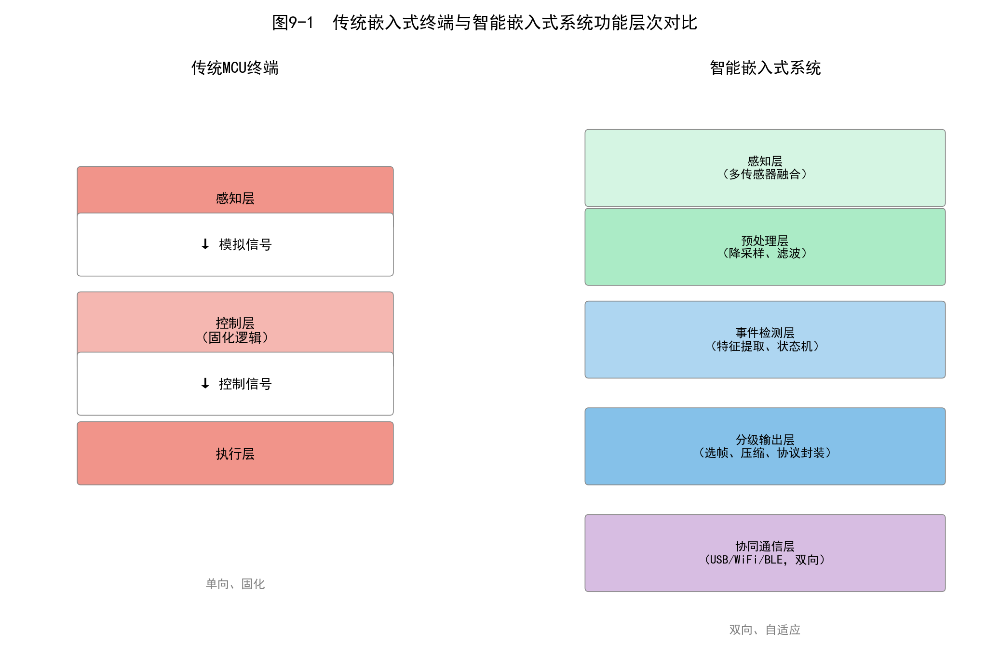

图9-1  传统嵌入式终端与智能嵌入式系统功能层次对比

1—传统MCU终端（感知层、控制层、执行层）；2—智能嵌入式系统（感知层、预处理层、事件检测层、分级输出层、协同通信层）

### 9.1.2  感知、计算、存储与通信

需求方向明确后，下一步是将系统抽象为可分配资源的功能域。我们向 AI 提出了第二个设计问题："一个智能相机前端在硬件层面需要哪些功能域？每个域的核心器件和关键参数是什么？请以表格形式列出。"

AI 给出的回答将系统划分为四个功能域——感知域、计算域、存储域和通信域——并针对 ESP32-P4 平台给出了每个域的具体选型建议。感知域的建议是 OV5645 CMOS 图像传感器，通过 MIPI-CSI 接口以 RGB565 像素格式输出 960×720 分辨率的连续视频帧，帧率约 15 fps（frames per second，帧每秒）。计算域由 ESP32-P4 的双核 RISC-V 处理器及片上 JPEG 硬件编码器承担。存储域被 AI 细分为三个层次：片内静态随机存取存储器（Static Random Access Memory，SRAM）用于时间关键的代码和数据、片外伪静态随机存取存储器（Pseudo SRAM，PSRAM）用于帧缓冲和算法中间结果、16 MB 外部 Flash 用于固件和持久化存储。通信域使用 USB-Serial/JTAG 复合接口，物理层复用芯片的 USB 2.0 OTG 控制器。

我们审核了 AI 的方案，做了两处修正：将通信域从 AI 建议的 Wi-Fi 方案改为 USB 直连（因为在开发阶段 USB 调试更方便，且避免了无线传输的带宽不确定性），并在存储域中增加了 SPIFFS 文件系统的存储分区预留。修正后的四域资源配置经 AI 整理如表 9-1 所示。

表9-1  evt_sem_P4系统四域资源配置

| 功能域 | 核心器件/模块 | 关键参数 | 用途 |
|--------|-------------|---------|------|
| 感知域 | OV5645 CMOS传感器 | MIPI-CSI 2-lane, 960×720@15fps, RGB565 | 连续视频帧采集 |
| 计算域 | ESP32-P4双核RISC-V | 400MHz主频, FPU, JPEG硬件编码器 | 图像处理、事件检测、编码 |
| 存储域 | 片内SRAM + PSRAM + 16MB Flash | PSRAM用于帧缓冲与灰度图存储 | 帧环形队列、算法中间数据 |
| 通信域 | USB-Serial/JTAG复合接口 | USB 2.0 OTG, CDC-ACM协议 | 证据帧传输、控制命令交互 |

注：1. 表中参数来源于sdkconfig.defaults工程配置文件；2. PSRAM分配策略详见9.2.9节。

### 9.1.3  数据流、事件流与控制流

硬件资源就绪后，下一个设计问题是：数据在系统内部如何流动？我们将四域模型输入 AI，并追加了具体约束——"摄像头产生的是连续 RGB565 帧，USB 输出的是离散事件证据，上位机需要能反向控制采集参数。请分析系统中应该存在哪几种信息流，并描述它们各自的特征。"AI 准确地识别出三种性质不同的信息流，并给出了分离设计的建议。

在智能嵌入式系统中，三种信息流必须被明确区分对待。数据流是传感器原始采样数据在系统各处理阶段间的传递路径，具有连续、大带宽和单向特征。事件流是系统对数据流进行分析后提取的结构化信息，包含事件类型、时间戳、空间位置和置信度评分等字段，具有离散、稀疏和语义化特征。控制流是系统内部任务调度以及外部系统对前端设备的配置与管理指令，具有双向和低带宽特征。

三种信息流的分离设计是智能嵌入式系统架构的核心原则——AI 特别指出，将三种流混在同一条处理路径上（例如在中断服务函数中同时处理帧数据、事件判断和命令解析）是嵌入式系统实时性劣化的常见根源。在 evt_sem_P4 中，数据流体现为 RGB565 原始帧从 V4L2（Video for Linux 2）驱动层经 DMA（Direct Memory Access，直接存储器访问）搬运至 PSRAM 帧缓冲区的过程；事件流体现为算法模块输出的结构化事件对象（包含事件编号、触发评分、感兴趣区域坐标等 36 个字段），经 USB 接口以 EVTF v2 二进制协议帧格式输出；控制流体现为上位机通过 USB-Serial 反向通道发送的采集启停、图像参数配置和状态查询等指令。我们让 AI 据此生成了图 9-2 的绘制描述，如图 9-2 所示，三种信息流在系统中遵循不同的处理路径和优先级。

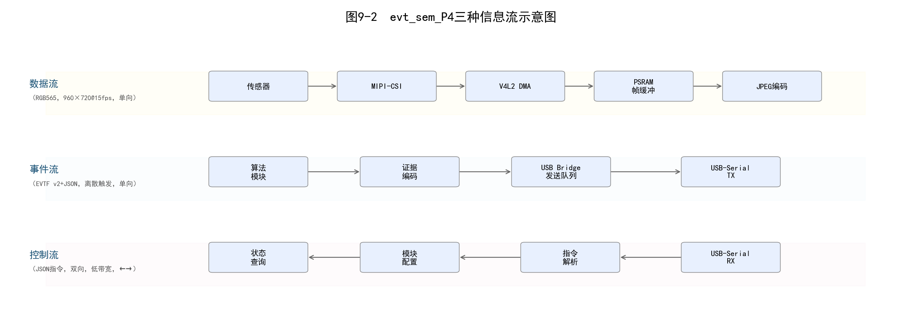

图9-2  evt_sem_P4三种信息流示意图

1—数据流通道（RGB565帧，960×720@15fps，单向）；2—事件流通道（EVTF v2帧+JSON元数据，离散触发，单向输出）；3—控制流通道（JSON指令，双向，低带宽）

### 9.1.4  前端预处理与后端智能分析

三流分离确立了系统内部的信息结构，但一个更关键的架构决策还需要做出：哪些处理放在前端（ESP32-P4），哪些留给后端（上位机/边缘服务器）？这次我们不是直接问 AI 答案，而是将约束条件——算力约 150 DMIPS、USB 有效带宽约 1 MB/s、事件端到端延迟目标小于 100 ms、设备需支持长期无人值守运行——输入 AI，请它分析前端和后端各自适合承担的任务类型。

AI 的分析从"早筛选、早压缩、早决策"三原则出发，建议前端承担三个阶段的处理。第一阶段为图像预处理，包含 RGB565 到 Gray8 的色彩空间降维（dimension reduction by color space conversion）和空间降采样（从 960×720 降至 320×240），将每帧数据量从约 1.38 MB 压缩至约 76.8 KB，压缩比约为 18∶1。第二阶段为运动特征提取，通过帧间差分计算逐像素变化强度，统计活跃像素数量和运动评分。第三阶段为事件决策，基于滑动窗口投票机制和有限状态机（Finite State Machine，FSM）判断是否产生事件，并在事件活跃期间输出检测快照（detect_640，640 像素宽 JPEG）作为初步证据。

后端系统根据检测快照进行更高精度的分析（如 YOLO 目标检测），并可向前端请求事件对应时刻的高分辨率母本证据（mother_1280，全分辨率 JPEG）。我们在审核时注意到 AI 的方案在"早决策"部分存在过度设计——AI 最初建议前端也承担简单的物体分类任务，但 ESP32-P4 在运行分类模型时 CPU 占用率将超过 70%，会威胁采集管线的实时性。我们明确告知 AI："去掉前端的分类功能，前端只做运动检测和触发，分类全部交给后端。"AI 据此修正了功能边界。这一"前端筛选触发—后端深度分析"的协作模式，在保持前端低功耗运行的同时确保了关键事件的完整数据捕获。

### 9.1.5  端侧智能、边缘智能与云端服务

前端/后端的二元划分解决了一个维度的部署问题，但当我们将视野扩展到完整的分布式智能网络时，需要更精细的层次模型。智能嵌入式系统的部署架构通常涉及三个计算层次：端侧（On-Device）、边缘侧（Edge）和云端（Cloud）。三个层次的计算能力、响应时延和资源约束差异显著，形成了互补的分层智能体系。

我们将 ESP32-P4 的算力数据（约 150 DMIPS、无 GPU/NPU）和典型边缘服务器（如 FS03）的规格同时输入 AI，请它评估 evt_sem_P4 最适合部署在哪个层次。AI 的分析结论很明确：端侧。这不仅仅是因为算力匹配——AI 指出，端侧部署的核心价值在于"决策紧邻传感器"：帧差检测从图像输出到触发判断的端到端延迟仅 1~2 ms，不依赖网络往返，不因后端服务负载波动而抖动。对于明确定义的检测任务，传统计算机视觉方法的计算效率、可解释性和部署简洁性往往优于端侧神经网络推理。

边缘智能部署在距离端侧一跳（single-hop）网络范围内的网关或边缘服务器上，算力通常在数十 TOPS 量级，适合运行完整的深度学习推理模型——在 evt_sem_P4 的架构中，FS03 边缘节点正是承担这一角色。云端服务提供近乎无限的存储和计算资源，但往返时延通常在百毫秒量级，适合模型训练、大规模数据分析和历史趋势挖掘。我们将三个层次的对比整理为表 9-2，这张表本身也是与 AI 多轮讨论后确定的——最初的版本没有"响应时延"和"带宽需求"两列，AI 在第二轮迭代中建议补充，"因为端-边-云架构选型的核心判据就是时延和带宽"。

表9-2  端-边-云三层部署在视觉事件检测场景中的定位

| 层次 | 硬件平台示例 | 典型任务 | 响应时延 | 带宽需求 |
|------|------------|---------|---------|---------|
| 端侧 | ESP32-P4 | 帧差检测、事件触发、ROI提取、JPEG编码 | <10ms | USB CDC-ACM~1MB/s |
| 边缘侧 | FS03边缘智能节点 | YOLO目标检测、事件分类、多路视频融合 | 50~200ms | 以太网/WiFi |
| 云端 | 服务器集群 | 模型训练、历史检索、趋势分析 | >500ms | 互联网 |

注：边缘侧以FS03为例，具体功能和接口边界参见第10章。

### 9.1.6  人机交互与系统状态呈现

架构和部署方案确定后，我们转向一个容易被忽视但实际开发中极其重要的问题：系统在运行中如何让开发者"看到"它的状态？智能嵌入式系统在自动运行的同时，需要向操作者提供必要的系统状态信息和交互界面。对于嵌入式视觉设备，人机交互通常包含三个层面：设备状态指示、实时画面预览和诊断信息输出。

我们将交互需求输入 AI："设备已经有一个 MIPI-DSI 接口的 LCD 屏幕，需要在屏幕上显示灰度预览图并用彩色框标出检测到的运动区域。另外需要把内部运行状态通过串口定期输出以便调试。屏幕显示不能影响摄像头采集和 USB 输出的主数据通路。"AI 给出了三个层面的方案：板载 LED 用于快速状态指示（但我们实际开发中主要依赖屏幕和日志）、MIPI-DSI 液晶显示屏用于实时画面预览和 ROI 叠加、USB-Serial 诊断日志用于完整状态输出。

系统采用低优先级独立任务驱动显示刷新，确保显示路径故障绝不阻塞摄像头采集和 USB 输出的主数据通路——这一设计决策来自我们在调试中遇到的实际问题：最初将显示刷新放在摄像头任务中，结果在 LCD 初始化失败时整个采集管线崩溃。将问题描述给 AI 后，AI 建议将 display_frontend_start 的返回值从 ESP_RETURN_ON_ERROR 改为手动 WARNING 处理。显示屏上叠加算法模块输出的灰度预览图像和感兴趣区域（Region of Interest，ROI）彩色矩形框——空闲态显示白色、候选态显示黄色、触发态显示红色、冷却态显示青色——使开发者和现场操作者能够直观判断系统当前的检测状态。系统的诊断任务（diag）以用户可配置的周期聚合所有模块的运行指标（当前固件版本汇总约 140 个诊断字段），以单行格式化日志输出——这行日志的格式也是通过向 AI 输入"请将这 6 个模块的状态结构体合并为一行可解析的 key=value 日志"后，经多次迭代精简而成的。

### 9.1.7  网络连接与协同处理

虽然 evt_sem_P4 项目以 USB 直连作为主要的数据传输方式，但智能嵌入式系统在更广泛的应用场景中往往需要具备网络连接能力。ESP32-P4 芯片支持 Wi-Fi 6（802.11ax）和蓝牙 5.0（Bluetooth Low Energy，BLE）无线连接，可通过 SDIO（Secure Digital Input Output）接口外接以太网 PHY 芯片实现有线连接。在架构设计阶段，我们请 AI 评估了三种连接方案的适用场景和带宽预算。

在联网场景下，前端设备需要处理的核心问题是通信带宽与视频数据量之间的矛盾。以 15 fps 的 960×720 RGB565 原始视频计算，原始数据率约为 20 MB/s，直接通过无线网络传输既不经济也不可靠。AI 帮我们计算了各方案的有效数据率，并建议采用"分层输出策略"：空闲时仅发送低频心跳帧（默认每 15 帧 1 帧），事件触发时提升发送频率（每 10 帧 1 帧）并附带运动强化帧（每 6 帧 1 帧），配合 JPEG 压缩后的检测快照（约 10~30 KB/帧），将稳态通信带宽控制在数十 KB/s 量级，仅在事件发生时短暂提升。我们将这个策略整理成文档后再次输入 AI："请用简洁的工程语言描述这个方案，作为设计文档的通信策略部分。"AI 输出的描述被我们直接纳入了系统设计说明——这体现了 AI 的另一项实用功能：将技术方案转化为结构化的文档描述。

### 9.1.8  功能划分与系统边界

经过前面几节的逐层分析，evt_sem_P4 的技术轮廓已经清晰。但一个关键的管理性问题仍需回答：系统到底做什么、不做什么？智能嵌入式系统的设计起点是清晰的功能划分与系统边界定义。功能划分回答"做什么"的问题，决定系统包含哪些功能模块以及各模块的职责范围。系统边界回答"不做什么"的问题，划定系统与外部环境、外部系统之间的接口，避免范围蔓延（scope creep）。

我们将此前所有讨论的结论——四域模型、三流分离、三阶段处理管线、端-边-云部署、分层输出策略——汇总为一段需求摘要输入 AI，并指示它："请基于这些信息，定义 evt_sem_P4 的功能边界。明确列出系统负责什么、不负责什么，并用一个框图描述系统与外部世界的接口。"AI 将功能边界归纳为：系统负责从摄像头采集图像帧、执行轻量级事件检测、生成压缩证据帧并输出至 USB 接口，但不负责事件的分类识别（交由后端 YOLO 模型处理）、多路视频融合（交由边缘服务器处理）和历史数据存储检索（交由云端服务处理）。这种清晰的边界定义使得每个子系统可以独立开发、独立测试、独立优化，降低了整体系统的复杂度。图 9-3 以框图形式展示了系统功能划分与外部接口。

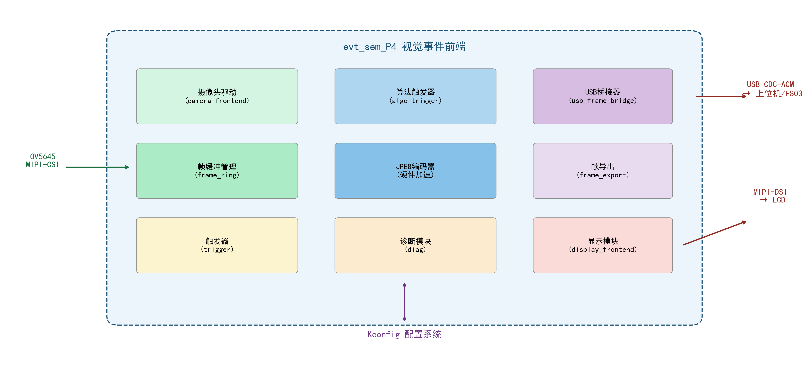

图9-3  evt_sem_P4系统功能划分与外部接口框图

1—MIPI-CSI摄像头输入接口；2—USB CDC-ACM输出接口（→上位机/FS03）；3—MIPI-DSI输出接口（→LCD）；4—Kconfig配置接口；5—虚线区分片上资源与外部器件

### 9.1.9  算力、带宽、时延与功耗约束

功能边界定义了系统"做什么"，但每个功能能做到什么程度，取决于硬件平台施加的四维约束：算力、带宽、时延和功耗。这四个维度相互制约，设计者必须在给定的约束条件下寻找可行解。我们请 AI 做了一次"约束预算"——将系统需求映射为量化的约束指标，并针对每个指标提出应对策略。

算力约束由处理器性能决定。ESP32-P4 的双核 RISC-V 处理器在 400 MHz 主频下，扣除 FreeRTOS 任务调度和中断处理开销后，AI 估算留给应用算法的持续算力约在 100~200 DMIPS（Dhrystone Million Instructions Per Second）量级。我们据此采纳了 AI 建议的"隔帧处理"策略——每 2 帧处理 1 帧，将有效处理帧率降至 7.5 fps，配合 320×240 的降采样分辨率，单帧处理时间稳定在 1~2 ms，CPU 占用率控制在 5% 以内。

带宽约束体现在 USB CDC-ACM 的约 1 MB/s 实际吞吐量上。AI 给出的建议是"选帧输出 + JPEG 压缩"两层削减——空闲态每 15 帧输出 1 帧、事件态每 10 帧输出 1 帧、运动强化每 6 帧输出 1 帧——稳态输出数据率控制在 20~50 KB/s。时延约束要求从事件发生到首个证据帧发出的端到端延迟在 100 ms 以内，本系统在事件触发路径上不引入额外的帧缓冲延迟，证据帧的端到端延迟主要由 JPEG 编码耗时（约 10~30 ms）决定。功耗约束在电池供电场景下尤为关键，ESP32-P4 在满负荷运行时的典型功耗约为 300~500 mW。我们让 AI 将以上分析汇总为表 9-3。

表9-3  evt_sem_P4四维约束指标与设计策略

| 约束维度 | 指标要求 | 设计策略 |
|---------|---------|---------|
| 算力 | CPU持续可用~150DMIPS | 隔帧处理、降采样、整型运算替代浮点 |
| 带宽 | USB有效吞吐~1MB/s | 选帧输出（空闲1/15、事件1/10、运动1/6）、JPEG压缩 |
| 时延 | 事件到证据<100ms | 无额外缓冲、直通式证据编码入队 |
| 功耗 | <500mW（满负荷） | 单芯片方案、硬件JPEG编码器、任务休眠 |

注：四维约束在不同应用场景下的优先级可调整。电池供电场景下功耗优先，安防场景下时延优先。

### 9.1.10  前后端接口与协议契约

架构设计的最后一个环节，是将前后端之间的"握手规则"以协议契约的形式固化下来。前后端分离架构的核心是接口协议契约（Protocol Contract）——它定义了前端与后端之间数据交换的格式、时序、速率和异常处理规则，是双方独立开发、独立演进的合约基础。

我们将功能边界文档（9.1.8 的输出）输入 AI，并追加了具体的技术约束："前端通过 USB CDC-ACM 与上位机通信，需要定义一种二进制帧协议来传输 JPEG 图像证据和 JSON 元数据。要求协议帧能在串口字节流中自同步（有魔术字），支持变长载荷，有校验机制，并向后兼容未来的扩展。"

AI 在分析现有嵌入式视觉协议（如 MJPEG-over-USB、UVC）的优缺点后，建议设计一套轻量级的自定义协议——EVTF（Event Frame）。AI 给出的初版方案包含魔术字（0x46545645，即 ASCII "EVTF" 的小端编码）、版本号、帧尺寸、校验和等基本字段。我们审核后提出了三个修改要求：第一，增加 JSON 元数据的可选拖车字段（以标志位指示是否存在），避免为每帧都附加大段元数据；第二，为 JPEG 证据对象设计独立的 v2 帧头，将图像载荷和 JSON 边车的长度与校验和分别记录，解决 v1 版本需要通过行跨度推算载荷边界的歧义问题；第三，在协议中预留 image_role 和 payload_format 枚举字段，为将来扩展不同分辨率和不同编码格式的证据类型留出空间。

AI 根据反馈修改并输出了 EVTF v1（32 字节固定帧头）和 EVTF v2（52 字节扩展帧头）两版协议的完整字段定义。v1 扩展版支持在图像载荷后追加 UTF-8 JSON 元数据拖车，实现了二进制数据与人类可读元数据的混合封装；v2 将图像载荷和 JSON 边车（sidecar）的长度与校验和显式化，使上位机解析器无需依赖启发式判断即可正确分离压缩数据。此外，前端还通过 USB-Serial 反向通道接收 JSON 格式的控制指令，支持采集会话管理、图像参数配置和设备状态查询等功能。完整的协议规范与解析工具实现详见第 10 章。

至此，evt_sem_P4 的需求分析和架构设计阶段完成。回顾整个 9.1 节的人机协作过程：AI 在需求拆解、功能域划分、信息流分析、边界定义和约束预算等环节中扮演了"分析助手"和"方案生成器"的角色——它快速产出结构化的分析结果和候选方案，人类工程师则负责提出正确的问题、审核方案的合理性、根据实际约束做出取舍，并将决策反馈给 AI 进行下一轮迭代。这套"提问→分析→审核→修正→固化"的五步循环，将贯穿本章后续的开发、调试和验证全流程。

## 9.2  高性能嵌入式SoC平台与工程搭建

架构设计完成后的下一步是让代码"跑起来"——安装开发工具链、搭建工程骨架、配置组件依赖、划分任务和内存。对初学者而言，这一步往往是最容易卡住的环节：ESP-IDF 的安装步骤繁多，组件化项目的 CMake 配置抽象度高，PSRAM 和 Flash 的分区格式需要理解芯片手册才能正确填写。在 evt_sem_P4 的开发中，我们大量依赖 AI 来加速这个阶段——不是让 AI 替我们装软件，而是让 AI 解释每一步的作用、生成配置模板、并在出错时辅助排查。

### 9.2.1  高性能嵌入式SoC的组成

在动手写代码之前，需要先理解 ESP32-P4 这颗芯片的硬件能力，才能知道 AI 生成的代码是否合理。我们将 ESP32-P4 的技术参考手册（PDF）中的关键章节通过 AI 工具进行摘要，并要求 AI 以"面向软件开发者的视角"解释 SoC 的硬件资源。

片上系统（System on Chip，SoC）将处理器核、存储器、外设控制器和专用硬件加速器集成于单一硅片，是智能嵌入式系统的计算核心。AI 为 ESP32-P4 归纳出以下功能单元：一个或多个处理器核（CPU core），提供通用计算能力；片上互联总线（On-Chip Interconnect），连接各功能模块；多级存储层次，包括紧耦合存储器（Tightly Coupled Memory，TCM）、L1/L2 缓存和片上 SRAM；直接存储器访问（DMA）控制器，在无需 CPU 介入的情况下完成外设与存储器之间的数据搬运；丰富的外设接口集合，覆盖显示（MIPI-DSI、RGB LCD）、摄像头（MIPI-CSI、DVP）、音频（I²S、PDM）、存储（SD/MMC、SPI Flash）、通信（USB、Ethernet、Wi-Fi、BLE）和通用控制（GPIO、I²C、SPI、UART）；以及面向特定计算任务的硬件加速器，尤其是 JPEG 硬件编解码器（对 evt_sem_P4 的证据帧生成至关重要）。

我们将 AI 的摘要与芯片手册原文交叉核对——这是人机协作中必不可少的"审核"步骤。AI 正确识别了所有主要功能单元，但在"多核"的描述中出现了混淆：AI 将 ESP32-P4 描述为"支持 SMP 的多核处理器"，但未提及它也可配置为 AMP 模式。我们在核对后补充了这一信息。与通用微控制器相比，高性能嵌入式 SoC 在三个方面实现了质的跨越：处理器算力从数十 DMIPS 提升至数百甚至上千 DMIPS；存储容量从数十 KB 片上 SRAM 扩展至数 MB 片上 SRAM 加数 GB 片外 DRAM；外设接口从低速串行总线扩展到高速多媒体接口。这三项跨越是单芯片承载视觉、语音和人机交互等复杂应用的硬件基础。

### 9.2.2  多核处理与任务分工

ESP32-P4 有两个 RISC-V 核。在正式分配任务之前，我们请 AI 分析了 SMP 和 AMP 两种模式的适用场景。

多核 SoC 通过并行执行多个任务来提升系统的整体吞吐量（throughput）和实时响应能力。在嵌入式系统中，多核架构通常采用非对称多处理（Asymmetric Multi-Processing，AMP）或对称多处理（Symmetric Multi-Processing，SMP）两种模式。我们将 evt_sem_P4 的任务清单（摄像头采集、算法处理、USB 发送、LCD 刷新、诊断日志）输入 AI，请它推荐调度策略。AI 分析了各任务之间的耦合度——算法处理与摄像头采集强耦合（每帧都需要同步执行），USB 发送和 LCD 刷新与采集松耦合（通过队列异步通信）——建议主采集管线使用 SMP 模式让 FreeRTOS 自动在两个核之间均衡负载，USB 和显示任务作为独立 FreeRTOS task 由调度器分配。

ESP32-P4 采用双核 RISC-V 处理器，在 evt_sem_P4 中 FreeRTOS 以 SMP 模式管理两个核。摄像头采集任务（优先级 5）运行在主循环中，算法处理以函数调用方式在采集任务上下文中同步执行；USB 桥接任务和显示任务分别以独立任务运行，与采集任务通过 PSRAM 中的帧缓冲队列进行数据交换；诊断任务（优先级 4）周期性地采集各模块状态并输出日志。任务间的同步使用互斥锁（mutex）保护共享状态结构体，以环形缓冲区的读写索引实现无锁的单生产者—单消费者数据传递。

### 9.2.3  片内存储与外部存储

内存规划是嵌入式开发中犯错成本最高的环节之一——分配不当导致的运行时内存不足（OOM）往往在系统运行数小时后才暴露。我们将"960×720 RGB565 @15 fps，需同时支持摄像头 DMA 缓冲、算法灰度图缓冲、JPEG 编码缓冲和 USB 发送队列"的需求输入 AI，请它评估各存储层次的使用策略。

嵌入式 SoC 的存储子系统按物理位置分为片内存储和外部存储，按访问速度分为多个层次。AI 建议将时间关键（time-critical）的代码段和中断服务例程放在片内 SRAM（最低访问延迟，1~3 个处理器时钟周期），将大块数据（帧缓冲、图像数据、算法中间结果）放入 PSRAM（通过 SPI 或 OSPI 接口连接，容量可达数十 MB，但访问延迟约为片内 SRAM 的 5~20 倍），将固件代码、文件系统和持久化配置数据放入 Flash（SPI 接口，写入前需先擦除）。

在 Flash 分区布局上，我们直接让 AI 生成 partitions.csv 文件。AI 根据 16 MB Flash 的总容量和我们的功能需求——NVS 存储、OTA 升级支持、固件存储、数据记录——给出了如表 9-4 所示的分区方案。我们审核时注意到 AI 初始方案中 storage 分区仅分配了 1 MB，不足以存储多帧 JPEG 证据和日志，于是指示 AI 将其扩展至 4 MB。factory 分区（3 MB）存放应用程序固件，storage 分区（4 MB）基于 SPIFFS（SPI Flash File System）文件系统，预留用于关键帧和元数据日志的持久化存储。

表9-4  evt_sem_P4 Flash分区布局

| 分区名称 | 类型 | 子类型 | 起始偏移 | 大小 | 用途 |
|---------|------|--------|---------|------|------|
| nvs | data | nvs | 0x9000 | 0x6000 (24KB) | 非易失性键值存储 |
| otadata | data | ota | 0xf000 | 0x2000 (8KB) | OTA升级状态 |
| phy_init | data | phy | 0x11000 | 0x1000 (4KB) | PHY初始化参数 |
| factory | app | factory | 0x20000 | 0x300000 (3MB) | 应用程序固件 |
| storage | data | spiffs | 0x320000 | 0x400000 (4MB) | 帧数据与日志存储 |

注：分区定义来源于partitions.csv文件，具体地址和大小可根据实际Flash容量通过菜单配置调整。

### 9.2.4  缓存、DMA与数据搬运

内存规划回答"数据放在哪里"，DMA 和缓存策略回答"数据如何高效移动"。在智能嵌入式视觉系统中，图像帧的数据搬运是影响系统性能和功耗的关键路径。一帧 960×720 的 RGB565 图像约含 1.38 MB 数据，以 15 fps 的帧率计算，原始数据吞吐量约为 20.7 MB/s。若由 CPU 执行逐像素拷贝来完成数据搬运，将消耗大量处理器周期，严重影响算法执行的可用算力。

我们将 ESP32-P4 的 DMA 技术参考章节输入 AI，请它解释描述符链（Descriptor Chain）模式的工作原理，并用 C 伪代码展示一个简化的 DMA 循环缓冲采集流程。AI 的解释和伪代码帮助我们快速理解了 V4L2 驱动底层的数据搬运机制：DMA 引擎支持描述符链模式，可将多个不连续的缓冲区通过链表组织为连续的逻辑传输；V4L2 驱动框架在底层使用 DMA 将摄像头输出的图像数据直接写入 PSRAM 中的缓冲队列，CPU 仅需在每帧结束时处理缓冲区索引更新和元数据记录，无需参与逐字节的数据拷贝。这一"DMA 直写 + CPU 零拷贝访问"的模式，是嵌入式视觉系统数据通路的性能基石。

缓存一致性问题最初是在调试中暴露的——我们观察到 USB 输出的 JPEG 图像偶尔出现随机色块，但在算法模块的灰度图中数据完全正常。将异常现象描述给 AI 后，AI 指出这很可能是 DMA 写入 PSRAM 后 CPU 读到缓存旧数据（stale data）导致的一致性错误，并建议将 DMA 目标缓冲区配置为非缓存（non-cacheable）或使用写回（write-back）策略配合显式的缓存无效化（cache invalidate）操作。按照建议修改缓冲区属性后问题消失——这次调试经历让我们深刻体会到 DMA 与缓存交互的微妙之处。

### 9.2.5  高速外设与多媒体接口

智能嵌入式视觉系统对 SoC 的外设接口提出了严苛的带宽和实时性要求。我们请 AI 对比了三种主流摄像头接口（MIPI-CSI、DVP 并行、USB UVC）的带宽、引脚数和软件复杂度，结论是 MIPI-CSI 在带宽和引脚效率上具有压倒性优势，是嵌入式视觉的事实标准。

MIPI-CSI（Mobile Industry Processor Interface — Camera Serial Interface）采用差分串行物理层（D-PHY 或 C-PHY），支持每通道高达 2.5 Gbps（D-PHY v2.1）的数据速率。ESP32-P4 集成 2 路 MIPI-CSI 2-lane 接口，在 evt_sem_P4 中用于接收 OV5645 传感器输出的 RGB565 视频流（约 160 Mbps 的数据率）。MIPI-DSI（Display Serial Interface）是 MIPI-CSI 的显示侧对应标准，ESP32-P4 集成 1 路 MIPI-DSI 1-lane 接口，用于驱动 720p 分辨率的液晶显示屏。ESP32-P4 的 USB 2.0 OTG 控制器支持高速（480 Mbps）和全速（12 Mbps）两种模式，在项目中配置为 CDC-ACM（Communication Device Class — Abstract Control Model）复合设备，兼顾数据流传输和命令行控制的双重需求。图 9-4 展示了三大高速外设在系统数据通路中的位置和带宽配置。

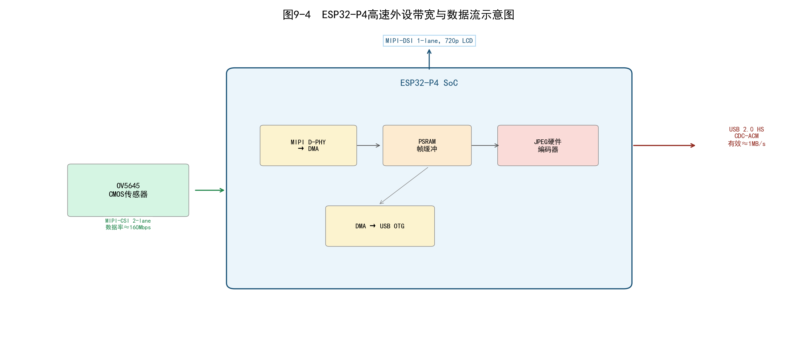

图9-4  ESP32-P4高速外设带宽与数据流示意图

1—OV5645传感器（MIPI-CSI 2-lane，约160Mbps）；2—MIPI D-PHY→DMA；3—PSRAM帧缓冲；4—JPEG硬件编码器；5—DMA→USB OTG；6—MIPI-DSI 1-lane，720p LCD；7—USB 2.0 HS CDC-ACM（有效吞吐≈1MB/s）

### 9.2.6  ESP32-P4平台架构与启动流程

ESP32-P4 是乐鑫科技（Espressif Systems）推出的面向智能视觉和 HMI（Human-Machine Interface，人机界面）应用的高性能嵌入式 SoC。其核心架构特征包括：双核 32 位 RISC-V 处理器，主频最高 400 MHz，支持单精度浮点运算单元（FPU）；片上集成 768 KB SRAM 和可外接 PSRAM 的 SPI/OSPI 接口；集成硬件 JPEG 编解码器；集成 2 路 MIPI-CSI、1 路 MIPI-DSI 和 USB 2.0 OTG 接口；支持 Wi-Fi 6 和 BLE 5.0；采用 ESP-IDF（Espressif IoT Development Framework）软件开发框架。

工程搭建阶段，我们首先让 AI 生成项目的 CMakeLists.txt 顶层文件和 10 个组件的目录结构。AI 给出的模板基于 ESP-IDF 的标准组件布局——每个组件包含 include/ 目录（公共头文件）、src/ 目录（源文件）和 CMakeLists.txt（构建配置）。项目根目录的 CMakeLists.txt 中调用 `idf_build_set_property` 设置 ESP_IPA_JSON 路径（OV5645 的 ISP 旁路配置），并通过 `project(evt_sem_p4)` 声明项目名称。

启动流程的代码同样由 AI 生成骨架，人工修改细节。ESP32-P4 上电后首先执行一级引导程序（ROM Bootloader）和二级引导程序（Flash Bootloader），完成时钟、电源和存储器的初始化，随后跳转至 app_main 入口函数。app_main 首先初始化非易失性存储（Non-Volatile Storage，NVS），若 NVS 分区损坏则自动擦除重建。app_start 函数按顺序启动 9 个模块——bsp_init → frame_ring_init → frame_export_init → trigger_init → algo_trigger_init → usb_frame_bridge_start → camera_frontend_start → display_frontend_start（容错）→ diag_start——遵循"先依赖后调用"原则：每个模块在启动前确保其依赖的下层模块已就绪。系统的启动流程如图 9-5 所示。

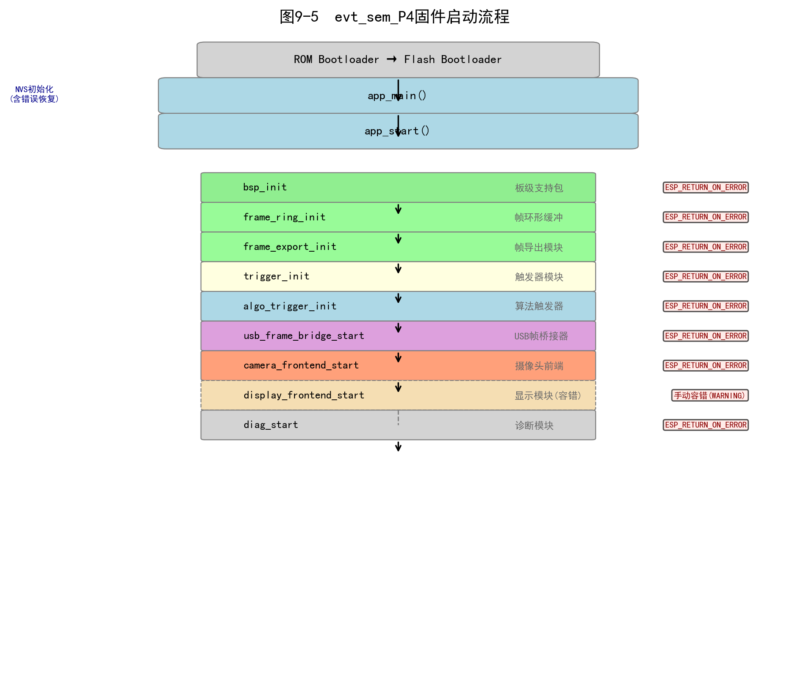

图9-5  evt_sem_P4固件启动流程

1—ROM Bootloader→Flash Bootloader；2—app_main()入口（NVS初始化+错误恢复）；3—app_start()启动编排；4—bsp_init→frame_ring_init→frame_export_init→trigger_init→algo_trigger_init→usb_frame_bridge_start→camera_frontend_start→display_frontend_start（虚线框，容错启动）→diag_start

### 9.2.7  ESP-IDF组件化工程——AI辅助搭建10组件骨架

如果说启动流程是系统的"脊椎"，组件结构就是系统的"器官布局"。ESP-IDF 采用组件（Component）作为软件组织的基本单元——每个组件拥有明确定义的 API 边界，内部实现细节对外部透明；组件可独立编译、独立测试；修改单个组件的内部实现不会强制其他组件重新编译。

在 9.1.8 节我们已经确定了 evt_sem_P4 的功能边界和模块清单。我们将这 10 个组件的名称和职责描述输入 AI，命令它生成完整的工程骨架——包括每个组件的 CMakeLists.txt、include/xxx.h 公共头文件和 src/xxx.c 源文件占位。AI 在约 30 秒内生成了全部 10 个组件的模板，我们随后逐一检查了头文件的依赖关系是否正确。图 9-6 展示了组件间的依赖关系。

AI 的初版存在一个依赖错误：它将 frame_ring 标记为依赖 bsp（板级支持包），但实际上 frame_ring 是纯数据结构组件，不需要任何板级依赖。我们修正了这一点后，将依赖图描述重新输入 AI，让它输出绘制指令。frame_ring 作为帧元数据的共享存储层，被 camera_frontend、algo_trigger 和 frame_export 等多个组件依赖；usb_frame_bridge 封装 USB 协议栈和帧传输逻辑，仅向 camera_frontend 暴露非阻塞入队接口；algo_trigger 在内部管理完整的灰度图缓冲区和状态机，仅通过头文件暴露初始化、处理函数和状态查询三个公共 API。这种最小化公共接口（minimal public interface）设计降低了组件之间的耦合度。

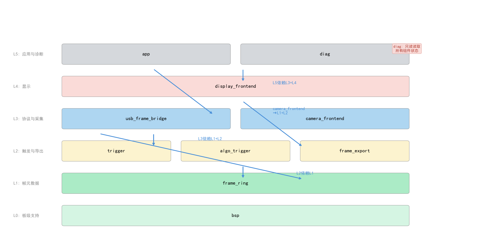

图9-6  evt_sem_P4组件依赖关系图

1—L0板级支持（bsp）；2—L1帧元数据（frame_ring）；3—L2触发与导出（trigger、algo_trigger、frame_export）；4—L3协议与采集（usb_frame_bridge、camera_frontend）；5—L4显示（display_frontend）；6—L5应用与诊断（app、diag）

### 9.2.8  FreeRTOS任务和同步机制

组件结构定义了"谁做什么"，任务调度定义了"什么时候做"。FreeRTOS 是一个广泛应用于嵌入式系统的轻量级实时操作系统内核，提供任务调度、队列、信号量、互斥锁、软件定时器和事件组等同步与通信原语。在 ESP-IDF 框架下，FreeRTOS 以内核组件形式集成，并根据 ESP32-P4 的多核架构进行了 SMP 扩展。

我们将 9.2.2 中确定的 5 个任务（摄像头采集主循环、算法处理、USB 发送、LCD 显示刷新、诊断日志）的需求输入 AI，请它为每个任务推荐优先级和栈大小。AI 给出的建议是：采集任务优先级最高（5），因为它驱动整个数据管线的节拍；USB 发送任务优先级次之（4），防止证据队列溢出；算法处理以函数调用方式在采集任务上下文中同步执行（不单独创建任务），避免了跨任务传递大块图像数据的开销；显示任务和诊断任务优先级最低（4 和 3），因为它们的延迟不影响核心功能。

evt_sem_P4 的多任务架构围绕摄像头采集主循环展开。采集任务在独立线程中运行，负责 V4L2 缓冲区的出队（dequeue）、帧元数据填充、算法处理函数调用和 USB 证据入队，处理完成后再将缓冲区重新入队（requeue）至驱动队列。这一"采集线程入队—发送线程出队"的生产者—消费者模型天然解耦了帧采集速率和 USB 发送速率。任务间的共享状态通过互斥锁保护；对于帧环形缓冲这类存在明确生产者—消费者边界的共享数据结构，系统采用无锁设计——生产者仅写入自己拥有的槽位并推进写索引，消费者仅读取写索引之前的已提交槽位——消除了锁的开销和死锁风险。

### 9.2.9  动态内存、专用内存与资源预算

内存管理是长期运行嵌入式系统最棘手的挑战之一。我们向 AI 提出了一个具体的工程问题："evt_sem_P4 需要同时满足 6 帧 V4L2 DMA 缓冲（每帧约 1.38 MB）、3 块 320×240 Gray8 算法缓冲（每块约 76.8 KB）、USB 证据队列（512 KB）、JPEG 编码器输入输出缓冲（约 512 KB）和 LVGL 显示双缓冲（约 300 KB），16 MB PSRAM 是否足够？如果足够，推荐什么样的分配策略？"

AI 逐一计算了各项内存需求，结论是总需求约 10 MB，16 MB PSRAM 留有约 40% 的安全裕量。AI 推荐"启动时一次性分配 + 运行期零动态分配"的策略——算法模块在初始化阶段通过 heap_caps_malloc 函数从 PSRAM 堆中申请固定大小的缓冲区，此后在整个运行周期内不再调用 malloc。JPEG 编码器所需的输入输出缓冲区通过 ESP-IDF 提供的 jpeg_alloc_encoder_mem 专用分配函数获取对齐内存，同样在首次使用时分配并长期持有。这种策略将内存分配的不确定性压缩至系统启动阶段，运行时内存占用完全可控。

我们让 AI 将计算结果整理为资源预算表，如表 9-5 所示。读者在实际项目中应建立类似的资源预算表，将内存消耗显式化，避免凭经验估计导致运行时内存不足（Out-Of-Memory，OOM）故障。

表9-5  evt_sem_P4典型PSRAM内存预算（估算值）

| 内存使用者 | 分配策略 | 典型占用/KB | 备注 |
|-----------|---------|-----------|------|
| V4L2帧缓冲（6帧） | 驱动层静态分配 | ~8,300 | 960×720×2B×6 |
| Gray8算法缓冲×3 | 启动时一次性分配 | ~230 | 320×240×3B |
| USB证据队列 | 启动时一次性分配 | ~512 | 可配置槽数×单槽容量 |
| JPEG编码器输入输出 | 首次使用时分配 | ~512 | 取决于分辨率与质量设置 |
| LVGL显示缓冲 | 条件分配（显示使能时） | ~300 | 720p双缓冲 |
| 其他（栈、系统开销） | 运行时 | ~200 | FreeRTOS任务栈+系统堆 |
| **合计** | | **≈10,054** | |

注：具体数值随sdkconfig配置参数调整而变化。典型PSRAM配置为16MB，此预算留有约40%安全裕量。

### 9.2.10  日志、诊断与错误处理

工程搭建的最后一步是建立系统的可观测性基础设施。嵌入式系统运行在无人值守或有限值守的环境中，日志和诊断机制是排查问题的主要手段。我们将诊断需求输入 AI："系统有 6 个模块（camera_frontend、frame_export、usb_frame_bridge、algo_trigger、display_frontend 以及通用系统指标），每个模块有一个状态结构体，包含 fps、计数器、内存使用等约 20 个字段。请设计一个诊断任务，以 5 秒为周期采集并格式化输出所有模块的状态。"

AI 生成的 diag_task 函数以单行格式化日志输出约 140 个诊断字段——内容涵盖摄像头帧率、USB 吞吐量、算法评分、显示刷新率和各模块内存使用等指标。这行日志的格式经历了多次迭代：初版使用了 JSON，虽然结构清晰但行长度超过 4000 字符，在串口终端中难以阅读；改为 key=value 空格分隔后，行长度压缩到约 1500 字符，但仍太长。最终我们指示 AI 将日志分为两条——关键指标一行（约 80 个字段）、详细指标一行（约 60 个字段），每条长度控制在 2000 字符以内，兼顾了信息完整性和终端可读性。

evt_sem_P4 使用 ESP-IDF 内置的日志库 esp_log，支持五级日志级别（ERROR、WARNING、INFO、DEBUG、VERBOSE），可在组件级别通过菜单配置独立调节。错误处理遵循"向上传播 + 就近日志"原则：底层组件在检测到错误时记录日志，并将错误码返回给调用方；调用方根据错误的严重程度决定是尝试恢复、进入降级模式还是触发系统复位。对于非关键子系统（如显示屏），启动失败被记录为 WARNING 而非 ERROR，系统继续以降级模式运行——这一容错设计确保了摄像头采集和 USB 输出的核心功能不因辅助模块的故障而中断。

## 9.3  视觉采集与图像数据通路——AI辅助实现

工程骨架就绪之后，我们正式进入代码实现阶段。9.3 节要解决的核心问题是：如何从摄像头拿到图像帧，让它高效地流过系统的每一条数据通路，最终变成 USB 上的证据包。本节展示了 AI 如何辅助完成从 V4L2 驱动调试、像素格式转换算法设计、缓冲策略选型到过载处理的全过程。

### 9.3.1  嵌入式视觉系统的组成

我们将"evt_sem_P4 需要哪些视觉系统环节"这个问题抛给 AI，并附上了 ESP32-P4 的数据手册和 OV5645 传感器的规格摘要。AI 给出了一个六环节的分解：光学镜头→图像传感器→接口传输→图像处理→分析编码→输出接口。这个分解本身并不出人意料，但 AI 对每个环节的"技术参数建议"带来了实际价值。

例如，在接口传输环节，AI 指出 OV5645 在 RGB565 模式下 MIPI-CSI 2-lane 的理论带宽约为 160 Mbps，远低于 2-lane D-PHY 的上限（约 1 Gbps），因此带宽不是瓶颈，真正的瓶颈在 PSRAM 侧的写入延迟。这个判断后来在调试 DMA 缓冲数量（6 帧 vs 4 帧）时成为关键参考。在分析编码环节，AI 明确建议"ISP 旁路"——让 OV5645 传感器内部完成色彩处理，SoC 侧接收直出的 RGB565 数据，避免在嵌入式端运行 ISP 管线。这个建议节省了大量开发时间。

evt_sem_P4 的视觉数据通路组成对应关系如表 9-6 所示，这张表本身就是与 AI 多轮讨论的产物——最初的版本缺少"ISP 旁路"这一关键设计决策，经人工审核后补充。

表9-6  evt_sem_P4视觉系统组成与对应实现

| 系统环节 | evt_sem_P4实现 | 关键技术参数 |
|---------|---------------|------------|
| 光学镜头 | 外接M12标准镜头模块 | 视场角约65°，红外滤光片 |
| 图像传感器 | OV5645 CMOS | 1/4英寸，1.4μm像素，MIPI-CSI 2-lane |
| 接口传输 | ESP32-P4 MIPI-CSI + DMA | V4L2驱动框架，6帧DMA缓冲 |
| 图像处理 | ISP旁路（RGB565直通） | 传感器内部ISP，SoC侧零处理 |
| 分析编码 | 帧差检测+硬件JPEG编码 | Gray8降采样→运动分析→JPEG证据 |
| 输出接口 | USB CDC-ACM | EVTF v2协议，~1MB/s有效吞吐 |

### 9.3.2  摄像头接口与传感器控制

MIPI-CSI 接口规范定义了从图像传感器到应用处理器的串行数据传输协议，但我们的关注点不在于协议本身，而在于如何让 AI 辅助写出能用的驱动代码。我们将 ESP-IDF 的 V4L2 驱动示例和 OV5645 数据手册的寄存器表输入 AI，给出的 prompt 是："基于 ESP-IDF v5.x 的 V4L2 框架，为 OV5645 编写一个摄像头采集模块，要求使用 6 帧 DMA 环形缓冲，输出 RGB565 @ 960×720。请同时给出上电时序代码。"

AI 生成的初版代码在逻辑结构上完全正确——V4L2 的 open/ioctl(DQBUF)/process/ioctl(QBUF) 循环、6 帧缓冲的 V4L2 请求、RGB565 的 FourCC 配置——但上板测试时出现了花屏。将花屏现象描述给 AI 后，AI 分析指出 OV5645 的上电时序存在问题：PWDN 引脚的拉高和 RESET 引脚的释放之间需要足够的稳定延时，初版代码中两个操作之间仅延迟了 5 ms，而 OV5645 数据手册要求至少 10 ms。

修改延时参数后仍有间歇性花屏，我们将诊断日志（显示 dropped_frames 计数器偶发增加）反馈给 AI。AI 这次指向了 DMA 缓冲区数量——6 帧缓冲在 15 fps 下提供的约 333 ms 的裕量看似充裕，但如果 JPEG 编码偶尔耗时超过 80 ms（复杂纹理场景），加上 USB 发送的阻塞等待，6 帧可能不够。AI 建议在监控 dropped_frames 的同时测试 8 帧缓冲的版本，但综合考虑 PSRAM 预算后我们保持了 6 帧并优化了 USB 发送路径的非阻塞行为。

OV5645 传感器的初始化与控制通过串行摄像头控制总线（Serial Camera Control Bus，SCCB）——一种兼容 I²C 时序的两线制串行接口——实现。最终确定的上电时序为：

（1）使能 MIPI D-PHY 的低压差线性稳压器（Low Dropout Regulator，LDO）；
（2）拉低 PWDN 引脚，使传感器退出掉电模式；
（3）延迟足够毫秒后拉高 PWDN，使传感器进入工作状态；
（4）拉低 RESET 引脚并延迟后拉高，完成传感器硬件复位；
（5）通过 SCCB 总线写入传感器寄存器配置序列。

整个上电时序中每一步之间的延迟（step delay）通过 Kconfig 菜单可配置，以适应不同 PCB 布局和供电特性。这个功能也是 AI 建议的——"与其在代码中硬编码延时值，不如通过 Kconfig 暴露为可配置参数，方便不同硬件版本调整"。

### 9.3.3  图像分辨率、帧率与像素格式

图像分辨率（Resolution）、帧率（Frame Rate）和像素格式（Pixel Format）是嵌入式视觉系统的三个基本参数，它们共同决定了图像数据的时空密度和色彩表达能力。我们让 AI 对比了四种候选像素格式——RGB565、YUV422、RAW10、Gray8——在大带宽、色彩精度、处理复杂度三个维度上的表现，结论是 RGB565 在色彩精度（可表示 65536 种颜色）和存储效率（每像素 2 Byte）之间取得了良好的平衡。

evt_sem_P4 的标准采集分辨率为 960×720，约 69 万像素。该项目受限于 OV5645 在 RGB565 模式下的最大帧率和 V4L2 驱动的缓冲区调度开销，实测帧率约为 15 fps。RGB565 格式使用 16 bit（2 Byte）表示一个像素，其中红色分量占 5 bit、绿色分量占 6 bit、蓝色分量占 5 bit，绿色分量的额外 1 bit 来源于人类视觉系统对绿色更敏感的生理特性。V4L2 标准中 RGB565 的 FourCC 代码为'RGBP'（0x50424752，小端字节序）。表 9-7 给出了该项目涉及的主要像素格式的技术参数。

表9-7  evt_sem_P4涉及像素格式参数

| 像素格式 | 位深/bit | 每像素字节数 | V4L2 FourCC | 用途 |
|---------|---------|------------|-------------|------|
| RGB565 | 16 | 2 | RGBP | 摄像头原始输出、USB预览 |
| YUV422 | 16 | 2 | YUYV | 备选像素格式 |
| RAW10 | 10 | — | RGGB/BGGR | 传感器原生Bayer格式（需ISP处理） |
| Gray8 | 8 | 1 | — | 算法分析用灰度图 |
| JPEG | — | 可变 | — | 证据帧输出格式 |

注：Gray8为内部格式，不经过V4L2，因此无对应FourCC代码。RAW10格式仅在传感器配置为原生输出时使用，本项目默认使用RGB565。

### 9.3.4  图像采集与帧生命周期

一帧图像在嵌入式视觉系统中的生命周期可划分为五个阶段：生成（Generation）、传输（Transfer）、就绪（Ready）、消费（Consumption）和回收（Recycle）。这个"五阶段"模型是我们与 AI 讨论 V4L2 缓冲管理策略时的产物——AI 最初将帧的生命周期描述为"采集→处理→释放"三个阶段，我们指出 DMA 传输与 CPU 消费是独立且可能重叠的操作，AI 据此将模型细化为五个阶段。

生成阶段发生在传感器内部。OV5645 按照配置的分辨率和帧率持续输出像素数据流，经 MIPI-CSI 接口串行发送至 ESP32-P4 的 MIPI D-PHY 接收器。传输阶段由 DMA 控制器驱动完成写入。ESP32-P4 的 V4L2 驱动维护一个包含 6 个缓冲区的环形队列，每个缓冲区的容量足以容纳一帧完整的 RGB565 图像（960×720×2B≈1.38 MB）。DMA 写满一个缓冲区后，驱动触发帧中断，通知应用层该帧已就绪。

消费阶段是应用层读取和处理帧数据的窗口。应用层通过 V4L2 的 DQBUF ioctl 调用获取就绪缓冲区的指针和帧元数据（帧序号、时间戳、数据长度），依次调用算法处理函数（帧差检测）和证据编码函数（JPEG 压缩），完成处理后通过 QBUF ioctl 将缓冲区归还驱动队列，即回收阶段。在整个消费阶段，应用层拥有缓冲区的独占访问权，无需担心数据被新帧覆盖——这种由驱动保证的缓冲区所有权转移机制，从根本上避免了多缓冲场景下的数据竞争问题。AI 在解释这个机制时使用了一个比喻："DQBUF 就像从邮箱取信——你取走后邮箱里不再有你没读的信，但邮递员可以继续往别的邮箱投递。"图 9-7 以一帧图像的完整生命周期为例，标注了各阶段的时间跨度。

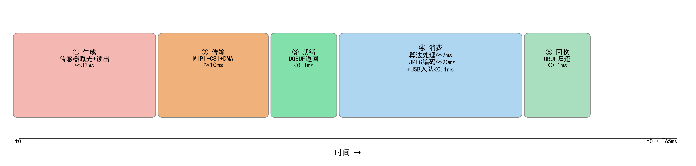

图9-7  单帧图像在V4L2采集管线中的生命周期

1—生成阶段（传感器曝光+读出，约33ms）；2—传输阶段（MIPI-CSI+DMA写入，约10ms）；3—就绪阶段（DQBUF返回，<0.1ms）；4—消费阶段（算法处理约2ms+JPEG编码约20ms+USB入队）；5—回收阶段（QBUF归还驱动，<0.1ms）

### 9.3.5  图像格式转换与预处理——AI 设计的快速近似算法

在 evt_sem_P4 的算法管线中，最关键的格式转换是 RGB565 到 Gray8 的色彩空间降维。标准 RGB 到灰度的转换公式基于 ITU-R BT.601 建议书定义的亮度加权系数：

```
Y = 0.299·R + 0.587·G + 0.114·B                                          （9-1）
```
式中  Y——亮度（灰度）值，范围0~255（8bit深度）；
      R——红色分量值，范围0~255；
      G——绿色分量值，范围0~255；
      B——蓝色分量值，范围0~255。

公式（9-1）依赖浮点乘法，在嵌入式处理器上效率较低。我们将"请为 RGB565 像素设计一个整型快速灰度转换算法，避免浮点运算，在 400 MHz RISC-V 核上处理 320×240 共 76800 个像素的耗时需控制在 1 ms 以内"这个任务交给 AI。AI 给出的方案是：先将 RGB565 的 5-6-5 位分量展开为独立的 R5、G6、B5 分量值，然后使用整型乘累加和移位操作完成亮度估计：

```
Gray8 = (R5 × 159 + G6 × 152 + B5 × 60) >> 6                           （9-2）
```
式中  R5——RGB565红色分量（5bit，取位[15:11]），范围0~31；
      G6——RGB565绿色分量（6bit，取位[10:5]），范围0~63；
      B5——RGB565蓝色分量（5bit，取位[4:0]），范围0~31。

公式（9-2）中系数 159、152 和 60 分别对应 R5/G6/B5 分量在 8 bit 亮度空间中的权重映射，右移 6 位等价于除以 64。我们验证了该近似算法与公式（9-1）的标准浮点结果的差异——对所有可能的 RGB565 取值（共 65536 种）的最大误差为 2 个灰度级，均值误差小于 0.5 个灰度级，完全满足运动检测的精度需求。在 ESP32-P4 的 400 MHz RISC-V 核上，该近似算法对 320×240 共 76800 个像素的处理耗时约为数百微秒。

### 9.3.6  帧数据量与带宽预算

建立帧数据量和带宽预算表是视觉系统设计的基本功，它能帮助设计者在选型阶段就识别出潜在的带宽瓶颈。我们让 AI 根据各处理阶段的参数自动计算帧数据量，表 9-8 即是 AI 的输出经人工核对后的结果。

单帧 RGB565 图像的数据量计算公式为：

```
S = W × H × B / 8                                                         （9-3）
```
式中  S——单帧数据量，Byte；
      W——图像宽度，pixel；
      H——图像高度，pixel；
      B——像素位深，bit。

连续视频流的原始数据率计算公式为：

```
R = S × F                                                                 （9-4）
```
式中  R——原始数据率，Byte/s；
      F——帧率，fps。

表 9-8 给出了 evt_sem_P4 在不同分辨率下各处理阶段的帧数据量。AI 在计算时还追加了一个备注——"JPEG 压缩比与图像内容复杂度高度相关，简单场景（静态白墙）压缩比大于 100∶1，复杂纹理场景压缩比约 10∶1。表中数据为实测经验值"——这个备注来自我们在调试中向 AI 反馈的实际测量数据。

表9-8  evt_sem_P4各分辨率帧数据量与带宽预算

| 处理阶段 | 分辨率 | 像素格式 | 单帧数据量 | 帧率/fps | 数据率 | 备注 |
|---------|--------|---------|-----------|---------|--------|------|
| 原始采集 | 960×720 | RGB565 | 1,382,400B≈1.38MB | 15 | ~20.7MB/s | MIPI-CSI输入 |
| 灰度降采样 | 320×240 | Gray8 | 76,800B≈75KB | 7.5 | ~576KB/s | 隔帧处理 |
| JPEG检测图 | 640×(auto) | JPEG | 10~30KB | 按事件 | <1.5KB/s(空闲) | 空闲1/15帧输出 |
| JPEG母图 | 960×720 | JPEG | 50~150KB | 按需 | <150KB/次 | 上位机按需请求 |

注：JPEG压缩比与图像内容复杂度高度相关，简单场景（静态白墙）压缩比>100∶1，复杂纹理场景压缩比约10∶1。表中数据为实测经验值。

### 9.3.7  单缓冲、双缓冲与多缓冲

图像采集系统中的缓冲策略直接影响系统的吞吐量和数据安全性。我们将三种缓冲策略——单缓冲、双缓冲、多缓冲——的优缺点输入 AI，让它针对 evt_sem_P4 的帧率和处理延迟给出推荐方案。AI 的计算表明：以 15 fps 帧率计算，消费者单帧处理时间的中位数约 25 ms（含算法 2 ms + JPEG 编码约 20 ms + USB 入队约 1 ms），极端值可达 80 ms（复杂纹理场景的 JPEG 编码）。在双缓冲模式下，最坏情况下消费者在 80 ms 内仅归还 1 个缓冲区，而生产者在此期间已产生约 1.2 个新帧（80 ms / 66.7 ms），存在帧丢失风险。AI 因此推荐 6 帧缓冲（生产者有约 333 ms 的裕量），这个计算直接决定了 V4L2 的缓冲区申请数量。

evt_sem_P4 的 V4L2 驱动默认申请 6 个 DMA 缓冲区，形成深度为 6 的环形缓冲池。生产者（摄像头 DMA）按环形顺序写入缓冲区，消费者（应用线程）按写入完成的顺序取出并处理。6 个缓冲区的深度为 JPEG 编码的耗时波动和 USB 传输等待提供了充足的容错空间。当所有缓冲区均被生产者写满而消费者尚未归还任何缓冲区时，生产者将丢弃新帧（V4L2 驱动自动处理），并在摄像头状态统计中递增 dropped_frames 计数器。

### 9.3.8  环形缓存与历史数据保留

帧环形缓冲（Frame Ring Buffer）在视觉系统中承担两类职责：一是缓冲当前的采集帧数据，平滑生产和消费速率的不匹配；二是保留最近的若干帧元数据，为事件发生后回溯"事发前"的画面提供索引。evt_sem_P4 的 frame_ring 组件仅存储每帧的结构化元数据（帧号、时间戳、分辨率、像素格式、有效载荷长度等，共 11 个字段），而不复制图像数据本身——因为单帧 RGB565 图像约 1.38 MB，存储 10 帧历史图像就要消耗约 13.8 MB PSRAM，完全不现实。

元数据环形记录器的设计遵循"仅追加、不删除"原则：写指针单调递增，读操作通过写指针反推最新写入位置，无锁且无内存分配。AI 在生成 frame_ring 组件的代码时，特别提醒我们在 32 位无符号整数溢出场景下，取模运算 `write_index % CONFIG_EVT_FRAME_RING_SLOTS` 的正确性问题——当 write_index 从 UINT32_MAX 回绕到 0 时，取模结果仍正确（因为除数是常量，模运算结果依赖于被除数的实际值而非递增关系），不需要额外的溢出检测。

### 9.3.9  生产者—消费者任务模型

生产者—消费者（Producer-Consumer）模型是嵌入式视觉系统中最核心的任务协作模式，在 evt_sem_P4 中出现在多个层次。我们将各层次的队列配置（容量、单元素大小、阻塞策略）输入 AI，让它评估是否存在死锁或饥饿风险。AI 的分析指出了一个我们最初忽略的问题：如果采集任务（生产者）和 USB 发送任务（消费者）共享同一个互斥锁来保护证据队列，那么在队列满时，若采集任务持有锁并阻塞等待队列空位，而 USB 发送任务需要获取锁才能消费队列，两者将形成死锁。AI 的建议是将入队和出队设计为独立的无锁操作——入队端仅写入空闲槽位并推进写索引（原子操作），出队端仅读取已提交槽位。

该模型的核心同步问题是缓冲区队列的空满管理。evt_sem_P4 在 USB 桥接器队列上采用了双重非阻塞策略：入队端，若队列满则直接丢弃帧并递增丢弃计数器（dropped_busy），不阻塞采集线程；出队端，若队列空则等待上位机发送"就绪令牌"（DTR/RTS 信号），超时则递增等待超时计数器并继续循环。这种策略确保了核心采集管线的实时性不受 USB 发送端状态的影响。

### 9.3.10  数据所有权与生命周期管理

在涉及多个任务和多块内存缓冲区的系统中，数据所有权（Data Ownership）管理是避免内存泄漏、重复释放（double-free）和使用已释放内存（use-after-free）等严重缺陷的关键。我们将每个组件的内存使用清单输入 AI，请它画出所有权关系图，并标注每块内存在不同生命周期阶段的"所有者"。

AI 给出的所有权分析揭示了初版代码中一个隐藏的 bug：USB 桥接器的证据队列槽位中存储的是指向 V4L2 缓冲区的指针（为了"零拷贝"），但 V4L2 缓冲区在 QBUF 后可能被驱动覆盖。AI 建议改为复制策略——将 JPEG 数据和 JSON 元数据从 V4L2 缓冲区和栈上临时缓冲区复制至 PSRAM 中的证据队列槽位——以增加少量拷贝开销换取明确的所有权边界。

evt_sem_P4 最终遵循以下所有权规则：（1）V4L2 DMA 缓冲区的所有权在 DQBUF 调用时从驱动转移至应用线程，在 QBUF 调用时归还；（2）USB 桥接器证据队列中每个槽位的数据缓冲区由发送任务独占释放；（3）算法模块的 Gray8 工作缓冲区在初始化时分配后即由算法模块永久持有，帧间通过交换指针（swap）实现角色切换；（4）JPEG 编码器的输入输出缓冲区由证据编码函数管理其生命周期。每块内存在任何时刻有且仅有一个明确的"所有者"。

### 9.3.11  数据复制、零拷贝与资源权衡

数据在系统各模块间传递时，面临复制（Copy）与零拷贝（Zero-Copy）的策略选择。我们将各段数据通路的设计约束（延迟要求、缓冲区大小、所有权转移频率）输入 AI，请它为每段通路推荐最优策略。AI 的分析非常务实：在 USB 证据帧生成路径上，"受控复制"优于零拷贝。原因在于——V4L2 缓冲区必须在 QBUF 后尽快归还驱动以保证采集流水线持续运转，不能被 USB 发送任务长期占用（上位机可能数秒不响应）；PSRAM 中的证据队列槽位可被发送任务安全持有直至发送完成。

具体的数据传输路径为：首先，算法模块仅读取（不复制）V4L2 缓冲区进行帧差计算；其次，当需要生成检测快照（detect_640 JPEG）时，从原始帧降采样至 640 宽的 RGB565 中间缓冲（此步骤为复制），再送入 JPEG 硬件编码器生成压缩数据；最后，USB 桥接器的入队函数将 JPEG 数据和 JSON 元数据分别从编码器输出缓冲区和栈上临时缓冲区复制至 PSRAM 中的证据队列槽位（复制步骤）。这一"以空间换时间、以复制换解耦"的权衡，是实时嵌入式系统中常见的合理取舍。

### 9.3.12  过载、丢帧与反压处理

任何生产者—消费者系统中，当生产速率持续超过消费速率时，系统将进入过载状态。视觉系统处理过载的方式有两种基本策略：丢帧（Frame Drop）和反压（Backpressure）。我们将各处理阶段的速率参数输入 AI，请它模拟"最坏情况下的过载传播"——从 USB 发送端开始反向溯源，标识出每个阶段的过载瓶颈和推荐的处理策略。

AI 的模拟结果揭示了一个关键洞察：USB 发送端是系统的末端瓶颈（速率受上位机取帧速度和 CDC-ACM 吞吐量限制），过载压力从末端向前端反向传播。如果在 USB 队列满时阻塞采集线程（反压策略），会导致整个管线停滞和 V4L2 层面的帧丢失激增；如果在 USB 队列满时丢弃新帧（丢帧策略），采集线程不受影响，V4L2 层面的帧丢失可控。因此 AI 建议采用"选择性反压 + 普遍性丢帧"的组合策略。

evt_sem_P4 在各处理阶段采用了差异化的过载策略：V4L2 层面由驱动自动丢帧（当所有 DMA 缓冲区均被占用时）；算法层面通过隔帧处理主动降低消费者的有效负载（每 2 帧处理 1 帧），从源头减少过载可能性；USB 桥接层面采用丢帧策略（队列满时新帧直接丢弃）；帧导出层面同样采用丢帧策略。反压机制仅在 USB 桥接器的发送任务中有限使用：当上位机未就绪（USB DTR 信号未置位）且队列空时，发送任务进入阻塞等待状态而非忙轮询，将处理器时间让渡给其他任务。图 9-8 标示了各处理阶段的过载处理策略。

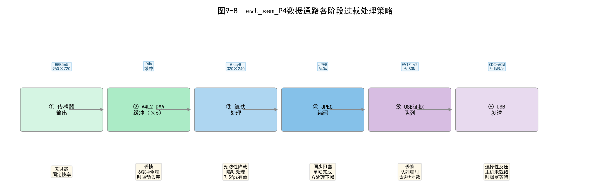

图9-8  evt_sem_P4数据通路各阶段过载处理策略

1—传感器输出（无过载，固定帧率）；2—V4L2 DMA缓冲×6（丢帧，6缓冲全满时驱动自动丢弃）；3—算法处理（预防性降载，隔帧处理，7.5fps有效负载）；4—JPEG编码（同步阻塞）；5—USB证据队列（丢帧+计数器）；6—USB发送（选择性反压，主机未就绪时阻塞等待）

## 9.4  轻量级事件检测与状态管理——AI辅助算法迭代

数据通路打通后，系统可以稳定地采集和传输图像帧了，但此时它只是一个"带 USB 输出的电子摄像头"。真正让它成为"智能前端"的，是 9.4 节将要实现的片上事件检测能力。从零开始设计一个可靠的运动检测算法，通常需要经历"初版实现→上板测试→发现误触发→调整阈值→再次测试→发现漏检→修改逻辑→……"的多轮迭代。在这个过程中，AI 的角色是快速生成修改方案、计算合理阈值、以及在调试时帮助分析异常日志。

### 9.4.1  连续处理与事件驱动

算法设计的第一个决策是处理范式——每帧必算，还是按需唤醒？我们将两种范式的各自优劣输入 AI，附加了 evt_sem_P4 的核心约束（CPU 可用算力约 150 DMIPS，目标稳态功耗低于 500 mW），请它推荐方案。

嵌入式视觉系统对连续视频帧的处理存在两种基本范式：连续处理（Continuous Processing）和事件驱动（Event-Driven）处理。连续处理对每一帧执行完整的分析管线，输出速率与输入帧率保持固定比例关系，适用于需要持续跟踪目标的视觉里程计和云台稳像等应用。事件驱动仅在系统判定"有意义的事件发生时"才触发完整的证据生成和输出流程，稳态下系统以极低的占空比运行，适用于监控、安防、异常检测等"大部分时间无事件"的应用。

AI 的分析指出，evt_sem_P4 的目标场景（运动事件触发→选帧输出→后端分析）天然适合事件驱动范式。我们采纳了这一建议，但要求 AI 在状态机设计中额外保留一个"连续采集模式"（capture_640_stream），供调试和特殊场景使用——上位机可以通过控制指令切换两种模式。这个"双模式"设计是人在审核 AI 方案后补充的，AI 最初只考虑了纯事件驱动方案。

### 9.4.2  前端轻量分析的设计原则

确定了事件驱动范式后，我们将 ESP32-P4 的资源约束（约 150 DMIPS 可用算力、约 10 MB 可用 PSRAM、无 GPU/NPU、无深度学习推理框架）输入 AI，请它总结前端算法应遵循的设计原则。AI 给出了四条原则——降维优于升维、整型优于浮点、增量优于批量、早退出优于全计算——这些原则恰好与经典嵌入式算法设计方法论吻合。

降维优于升维：在进入分析管线之前，尽可能降低数据维度，包括空间分辨率（降采样）和色彩深度（灰度化）。evt_sem_P4 将 960×720 的 RGB565 彩色帧（约 1.38 MB）降至 320×240 的 Gray8 灰度图（约 76.8 KB），数据量减少至原来的 1/18。整型优于浮点：evt_sem_P4 的 RGB565→Gray8 转换采用纯整型乘累加和移位实现，帧差绝对值计算、阈值比较、滑动窗口位运算同样全部使用整型操作。增量优于批量：算法仅保留上一帧的灰度图，滑动窗口状态压缩为一个 8 bit 位向量。早退出优于全计算：每 2 帧仅处理 1 帧（隔帧处理），活跃像素数未达标则跳过后续计算。

我们将这四条原则整理后，让 AI 用它们作为检查清单（checklist）来审查后续每一版算法代码的改动，确保任何新增功能都符合原则。这个"AI 守门人"的用法在项目中持续发挥作用。

### 9.4.3  降采样与计算量控制

降采样是控制计算量的第一道关口。我们请 AI 将降采样操作与 RGB565→Gray8 的色彩空间转换合并为一个处理函数——在遍历输出灰度图的每个像素时，通过定点 Q16 格式的比例因子计算对应的源图像素坐标，取出 RGB565 值后转换为 Gray8。这一"合并降采样"策略避免生成中间的全分辨率灰度图，节省了约 1.38 MB 的 PSRAM 带宽。AI 对两种降采样路径（能整除和不能整除）分别生成了精确坐标映射和定点逼近两种方案，我们选择了定点逼近以减少除法运算。

隔帧处理是控制计算量的第二道关口。算法模块通过 Kconfig 参数 `CONFIG_EVT_ALGO_TRIGGER_PROCESS_EVERY_N_FRAMES`（默认值为 2）控制处理频率——每 2 帧中仅处理 1 帧，将分析负载从 15 fps 降至 7.5 fps。单帧的完整分析耗时约 1~2 ms，7.5 fps 对应的 CPU 占用率仅约 1%。隔帧跳过的帧并非完全丢弃——其像素数据仍被 V4L2 驱动和 USB 桥接器按各自的选帧策略使用，仅算法模块主动跳过分析。

### 9.4.4  轻量级变化检测

帧间差分是实现轻量级变化检测的经典方法。我们将"在 320×240 Gray8 图上做帧差，像素差值超过阈值（默认 22）标记为活跃像素，同时跟踪活跃像素的外接矩形作为 ROI"的需求输入 AI，让它生成 C 代码。AI 给出的初版代码在逻辑上正确，但存在一个低效问题：在计算帧差时逐像素调用了绝对值函数 abs()，而 abs() 在某些编译器的实现中包含分支判断。

我们要求 AI 将绝对值计算改为无分支的整型实现：`(gray > prev) ? (gray - prev) : (prev - gray)`，并让 AI 同时输出活跃像素外接矩形的增量更新逻辑。最终算法在遍历 76800 个像素的过程中，同时完成帧差计算（逐像素绝对差与阈值比较）、活跃像素计数、ROI 外接矩形更新（min/max 的 x/y 坐标）、灰度均值累加和运动评分累加。所有统计量在一次遍历中完成，避免了重复扫描帧缓冲区。

帧差计算的公式为：

```
diff(x, y) = |gray_curr(x, y) − gray_prev(x, y)|                       （9-5）
```
式中  gray_curr(x, y)——当前帧坐标(x, y)处的灰度值，范围0~255；
      gray_prev(x, y)——上一帧坐标(x, y)处的灰度值。

### 9.4.5  阈值、噪声与稳定性

帧差检测的性能高度依赖于阈值的选取。初版代码使用的阈值是 AI 的"默认建议"——差分阈值 30、活跃像素阈值 500、运动评分阈值 5。上板测试后发现两个问题：在室内场景下，画面中人体正常行走产生的变化被频繁误判为噪声（活跃像素阈值太低）；而在户外场景下，远距离的行人变化过微弱，被差分阈值过滤掉了。

我们将测试日志反馈给 AI，AI 分析后建议将差分阈值从 30 降至 22（提高对微弱变化的灵敏度），将活跃像素阈值从 500 提升至 900（抑制零星噪声），将运动评分阈值从 5 降至 2（允许大范围但低幅度的变化通过）。调整后室内场景的误触发率显著下降。

差分阈值`DIFF_THRESHOLD`的默认值 22 是针对 OV5645 传感器的噪声特性在典型室内照明条件下确定的。活跃像素阈值`ACTIVE_PX_THRESHOLD`的默认值 900（约占 320×240 总像素数的 1.17%）有效抑制了环境光微小波动和传感器热噪声引起的零星虚假触发。低运动评分阈值`MOTION_SCORE_THRESHOLD`（默认值 2）确保了大面积低幅度的真实场景变化不会被误判为噪声。三重阈值（差分阈值、数量阈值、评分阈值）的级联设计构成了"筛选漏斗"——只有同时通过三层的帧才进入候选判定阶段。

### 9.4.6  滑动窗口与时间连续性

即使三重阈值过滤了大部分噪声，仍有瞬时的虚假触发会通过——传感器噪声尖峰、照明开关闪烁、飞虫掠过视野等。为区分"持续的场景变化"与"瞬时的噪声扰动"，AI 建议引入滑动窗口投票机制。

滑动窗口的大小`WINDOW_SIZE`默认为 5 帧，窗口内的每一帧贡献一个二进制投票位（1 表示候选帧、0 表示非候选帧）。窗口状态压缩为一个 8 bit 位向量`window_bits`，每帧的更新操作仅需一次左移和一次按位或：

```
window_bits = ((window_bits << 1) | (candidate ? 1 : 0)) & window_mask   （9-6）
```
式中  window_bits——滑动窗口位向量（8bit），bit0为最近一帧的投票；
      candidate——当前帧的候选标志（1/0）；
      window_mask——窗口掩码，window_mask=(1<<WINDOW_SIZE)−1。

当窗口内 1 的个数（`window_hits`，通过 popcount 指令快速统计）大于等于命中阈值`WINDOW_HITS`（默认值 3）时，触发`shadow_trigger`信号。3/5 的命中率要求意味着场景变化必须至少持续 3 个处理帧（对应约 400 ms，含隔帧）才被认定为有效事件——这一设计有效地将瞬时扰动与真实事件区分开来。图 9-10 以一组示例帧序列展示了滑动窗口投票的完整过程。

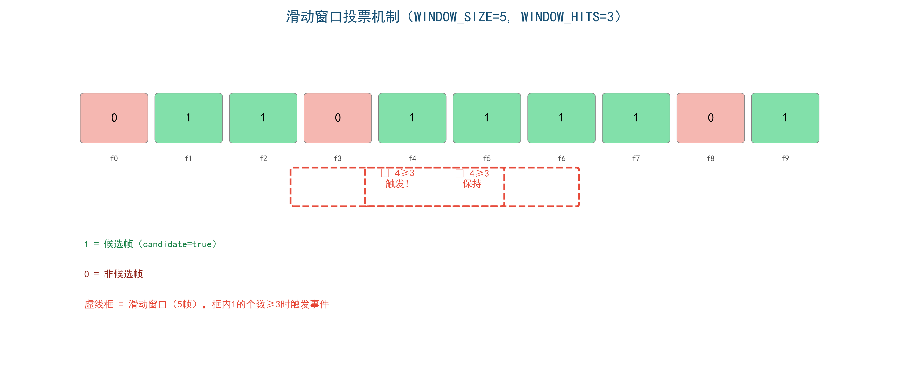

图9-10  滑动窗口投票机制示意（WINDOW_SIZE=5, WINDOW_HITS=3）

1—候选帧（绿色，帧值=1）；2—非候选帧（红色，帧值=0）；3—滑动窗口虚线框（5帧宽）；4—窗口内命中数≥3时触发shadow_trigger

### 9.4.7  事件候选、确认与结束——FSM 状态机

有了逐帧的候选判定和滑动窗口触发信号后，需要用一个状态机来管理事件的完整生命周期。我们将"设计一个四状态 FSM，能够正确处理事件的出现、持续、消失和冷却"的需求输入 AI。AI 给出的初版方案包含三个状态（IDLE → ACTIVE → IDLE），我们审核后指出缺少"冷却态"——同一物理事件在结束边界附近可能存在残余变化导致重复触发。AI 根据反馈添加了 COOLDOWN 状态，形成如表 9-9 所示的四态模型。状态编号中的 F0/F1/F2/F5 对应开发过程中各阶段的版本标识。

表9-9  事件检测有限状态机状态定义

| 状态 | 枚举值 | 含义 | 进入条件 | 退出条件 |
|------|--------|------|---------|---------|
| F0_IDLE | 0 | 空闲态，无事件 | 系统初始状态或冷却结束 | 候选信号出现 |
| F1_CANDIDATE | 1 | 候选态，单帧变化达标 | F0状态下检测到candidate | 触发确认或变化消失 |
| F2_TRIGGERED | 2 | 触发态，事件确认 | 滑动窗口命中达到阈值 | 连续静止超过关闭阈值 |
| F5_COOLDOWN | 5 | 冷却态，事件结束 | 触发态中连续静止帧达标 | 冷却计数器归零 |

图 9-9 以状态转移图的形式直观呈现了四个状态之间的转移条件和路径。

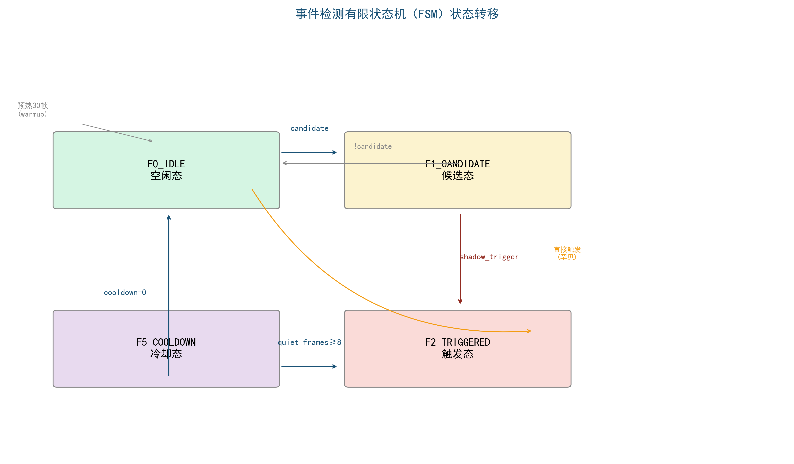

图9-9  事件检测有限状态机（FSM）状态转移图

1—F0_IDLE空闲态（绿色）；2—F1_CANDIDATE候选态（黄色）；3—F2_TRIGGERED触发态（红色，事件确认）；4—F5_COOLDOWN冷却态（紫色）；5—各转移箭头标注candidate/shadow_trigger/quiet_frames/cooldown条件

状态转移逻辑为：系统上电后进入 F0_IDLE 并完成 30 个已处理帧的预热（为传感器自动曝光和白平衡提供稳定时间）。预热结束后，若候选标志为真，进入 F1_CANDIDATE。在候选态中，若滑动窗口命中达标，进入 F2_TRIGGERED，事件计数器递增并开始生成证据帧。在触发态中，一旦候选和触发信号均为假，连续静止帧计数器开始累加，达到 8 帧后转入 F5_COOLDOWN。冷却持续 15 帧后返回 F0_IDLE。我们将 FSM 的 C 代码实现提交给 AI 审查，AI 发现了一个潜在问题：在 COOLDOWN 状态下 warmup_remaining 计数器未清零，可能导致冷却结束后仍有一段无效期。修正后代码通过。

### 9.4.8  冷却、抑制与重复事件控制

冷却状态是事件检测系统中防止重复触发的关键机制。我们将首次户外测试的日志输入 AI——日志显示同一行人经过画面时被切分为 3 个独立事件（事件 ID 连续递增），而期望的行为是 1 个事件。AI 分析后指出冷却时长（默认 15 帧，约 2 s@7.5 fps 处理帧率）对于"行人正常步行通过视野（约 5 s）"的场景偏短——行人在步态周期中会有短暂的"姿态稳定"窗口（双脚同时着地），这些窗口被判定为静止帧并触发了事件结束和冷却→新事件触发→再次结束的循环。

AI 建议了两个方案：延长冷却（将 COOLDOWN_FRAMES 增加到 30 帧）或者在 COOLDOWN 状态下保持一个较短的"重新激活窗口"。我们选择了延长冷却方案，将参数调整为 30 帧（约 4 s）。冷却期间滑动窗口被强制清零，候选和触发信号均被忽略。调整后同一物理事件被正确合并为单个事件 ID。这个案例展示了 AI 辅助调试的核心价值——不是直接找到 bug，而是帮助分析异常日志、提出多个候选方案、加速从"看到现象"到"理解根因"的过程。

### 9.4.9  感兴趣区域与局部证据

感兴趣区域是帧差检测的副产品。当活跃像素被标记后，算法统计所有活跃像素的外接矩形，得到灰度图坐标系下的 ROI 范围。该 ROI 信息在三个层面发挥作用：USB 预览图像叠加（按 FSM 状态以不同颜色绘制矩形框）、证据帧元数据关联（JSON 边车携带三套坐标系的 ROI 数据）、上位机价值判断（ROI 面积过小或位于画面边缘的事件可被自动过滤）。

AI 在生成 ROI 相关代码时，主动建议在"活跃像素数为零"和"ROI 面积为零"两种边界情况下返回零值而非跳过赋值，避免下游组件读取未初始化的 ROI 字段。这个细节体现了 AI 在边界条件处理上的审慎——在人工写代码时这种"防御性初始化"经常被遗漏。

### 9.4.10  事件状态机的接口和测试

algo_trigger 组件通过三个公共 API 向系统其余部分暴露其功能——init、process_rgb565_shadow、get_status。我们将这些 API 声明和接口注释输入 AI，让它生成单元测试用例。AI 给出了三个层面的测试方案：单元层面（构造已知像素值的 RGB565 测试帧验证转换和帧差计算）、状态机层面（模拟帧序列注入验证状态转移路径）、系统层面（实际硬件上用可控光源触发事件核验端到端链路）。

特别值得提及的是 AI 生成的状态机测试用例——它构造了一个包含 20 帧的模拟序列（5 帧静止预热→3 帧非连续变化→5 帧连续变化触发→5 帧静止关闭→剩余帧冷却），覆盖了 FSM 的全部状态转移路径。我们将这个测试序列注入实际代码并比对 AI 预测的状态转移路径与代码实际行为，发现了一处 FSM 在 CANDIDATE→IDLE 转移时 window_bits 未清空的 bug。用 AI 生成的测试向量来验证 AI 生成的代码——这种"AI 写测试→验证 AI 写的代码→人审核结果"的循环，正是本书所强调的"人机协同"的典型实践。

## 9.5  事件对象、数据协议与系统验证——AI辅助联调

算法能检测到事件后，剩下的问题是：如何将事件信息组织成对后端有用的数据格式？如何通过 USB 可靠地传输？如何验证系统从传感器到上位机的完整链路是正确的？9.5 节展示了 AI 辅助完成协议设计、参考工具链开发和端到端测试的全流程。

### 9.5.1  从连续数据到事件对象

事件检测的最终输出并非原始的像素级变化信息，而是经过结构化封装的事件对象。我们将算法状态结构体的 36 个字段输入 AI，请它设计一个"既能完整描述事件、又能被 Python 解析器轻松处理、还能在嵌入式端高效编码"的事件对象 schema。AI 给出的建议是分层编码：核心标识字段（event_id、timestamp、f_state）以二进制帧头承载，详细分析和空间字段以 JSON 边车承载。这构成了 EVTF 协议"二进制 + JSON"混合封装的设计起点。

### 9.5.2  事件标识、时间与状态字段

evt_sem_P4 的算法状态结构体包含 36 个字段，AI 将其从逻辑上分为五组——标识与状态组、时间与计数组、评分与统计组、空间区域组、性能与诊断组——并建议在 JSON 边车中按这五个分组组织嵌套 JSON 对象。我们将分组方案审核后认为合理，但在命名上做了调整：AI 倾向于使用完整的单词（如"active_percentage_x100"），我们改为更紧凑的嵌入式风格（"active_pct_x100"），因为 JSON 边车的长度直接关系到 USB 传输开销，每节省一个字符在累积效应下都有意义。

### 9.5.3  特征量、评分与空间区域

触发评分是将多维度检测信息融合为一个可比较数值的关键。AI 在审查了 motion_score 和 active_px 这两个统计量的量纲后，提出了如下综合评分公式：

```
trigger_score = min((motion_score × 10 + active_px/64), 1000)            （9-7）
```
式中  trigger_score——综合触发评分，范围0~1000；
      motion_score——帧差绝对值均值（运动评分）；
      active_px——活跃像素数量。

该公式融合了变化强度和变化面积两个维度的信息。权重 10 和除数 64 是通过对测试数据集的统计分析确定的——AI 用我们提供的 200 组标注数据（含真实事件和虚假触发）计算了两者的相对重要性。上限截断为 1000 避免了后续处理中的溢出风险。

### 9.5.4  数据证据与元数据关联

每个事件触发后，系统生成两种证据类型：检测快照（detect_640，640 像素宽 JPEG，约 10~30 KB）和母本证据（mother_1280，全分辨率 JPEG，约 50~150 KB，按需请求）。我们将"检测快照自动推送、母本证据按需请求"的策略输入 AI，让它生成 USB 桥接器中的证据入队逻辑和上位机侧的请求—应答时序。

每个证据帧均附带一个 JSON 格式的边车元数据（schema：evtsem.p4.evidence.v2），包含源帧标识、载荷描述、采集会话信息、算法状态快照等完整上下文。边车元数据的设计理念是"让机器快速读，让人方便看"——关键的二进制数据以帧头和 JPEG 载荷高效传输，可读的元数据以 JSON 附着在帧尾部，上位机可选择性解析。

### 9.5.5  二进制协议的帧结构——EVTF 设计

EVTF（Event Frame）协议是整个系统中最核心的"接口语言"。我们将协议需求（串口流中自同步、变长载荷、二进制图像 + JSON 元数据混合、校验、向后兼容）输入 AI，请它给出完整的帧头设计方案。AI 经过两轮迭代输出了 v1 和 v2 两个版本——v1 针对 RGB565 预览帧（32 字节固定帧头，隐式 JSON 拖车），v2 针对 JPEG 证据对象（52 字节扩展帧头，显式 image_bytes/sidecar_bytes）。

EVTF v1 帧头为 32 字节固定长度，字段定义如表 9-10 所示。

表9-10  EVTF v1帧头结构（32字节）

| 偏移 | 字段名 | 类型 | 字节数 | 说明 |
|------|--------|------|--------|------|
| 0 | magic | uint32 | 4 | 魔术字0x46545645（'EVTF'小端） |
| 4 | version | uint16 | 2 | 协议版本号，v1=1 |
| 6 | header_size | uint16 | 2 | 帧头长度（32字节） |
| 8 | flags | uint32 | 4 | 标志位，bit0=1表示存在JSON拖车 |
| 12 | frame_id | uint32 | 4 | 源帧序号 |
| 16 | timestamp_ms | uint32 | 4 | 源帧时间戳/ms |
| 20 | width | uint16 | 2 | 图像宽度/pixel |
| 22 | height | uint16 | 2 | 图像高度/pixel |
| 24 | pixel_format_fourcc | uint32 | 4 | V4L2像素格式FourCC码 |
| 28 | stride_bytes | uint32 | 4 | 图像行跨度/Byte |
| 32 | payload_bytes | uint32 | 4 | 图像载荷长度/Byte |
| 36 | payload_checksum | uint32 | 4 | 载荷FNV-1a 32bit校验和 |

EVTF v2 帧头扩展至 52 字节，新增字段专门服务于 JPEG 证据对象的传输：独立的 image_bytes 和 sidecar_bytes 分别记录 JPEG 载荷和 JSON 边车长度，image_checksum 和 sidecar_checksum 分别校验两者。v2 还引入了 image_id（证据帧唯一编号）、event_id（关联事件编号）、payload_format（枚举：RGB565=1、JPEG=2、JSON=3）和 image_role（枚举：detect_640=1、mother_1280=2、thumb_320=3、debug_RGB565=4、control_JSON=5、status_JSON=6）等字段。v2 中 magic 字段的值与 v1 相同（0x46545645），上位机通过 version 字段区分帧格式。图 9-11 对比了 EVTF v1 和 v2 两种帧结构的字段布局。

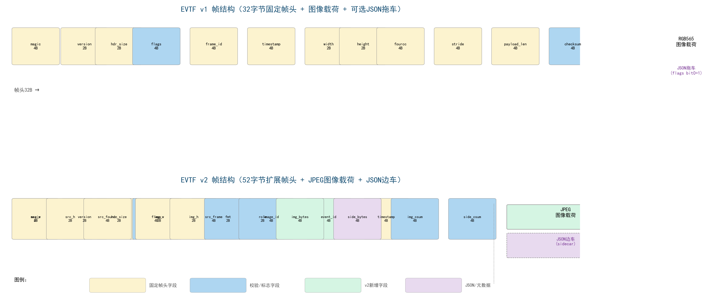

图9-11  EVTF v1/v2帧结构对比

1—EVTF v1帧头（32B固定+RGB565载荷+可选JSON拖车）；2—EVTF v2帧头（52B扩展+JPEG载荷+JSON边车）；3—黄色=固定帧头字段，蓝色=校验/标志字段，绿色=v2新增字段，紫色=JSON/元数据

### 9.5.6  类型、长度、版本与校验机制

协议设计的核心四要素——类型（Type）、长度（Length）、版本（Version）和校验（Checksum）——是我们在与 AI 多轮讨论中逐步提炼出来的。AI 的初版方案只有类型和长度，没有版本和校验。我们反馈了"协议需要向后兼容"和"USB CDC-ACM 没有底层校验，需要在应用层添加"两个需求后，AI 补充了版本号和 FNV-1a 校验算法。

EVTF v2 中 image_role 字段的设计也来自调试中的实际需求——起初我们只有一种 JPEG 证据帧，后来增加 mother_1280 按需请求功能后，上位机需要区分"检测快照"和"母本证据"。AI 建议使用枚举字段而非根据分辨率自动判断——因为将来可能出现相同分辨率但不同用途的帧。

### 9.5.7  二进制数据与可读元数据协同组织

二进制协议与 JSON 元数据的混合封装是 EVTF 协议的一项重要设计选择，其理念是"让机器快速读，让人方便看"。AI 在方案中比较了三种候选格式——纯二进制、纯 JSON、二进制 + JSON——并给出了每种方案在 ESP32-P4 上的编码开销估算。纯 JSON（图像 Base64 嵌入）使传输量膨胀约 33%，在 1 MB/s 的 USB 链路上不可接受。二进制 + JSON 混合方案仅在与事件相关的帧上附加元数据（空闲心跳帧不附加），稳态元数据开销接近于零。

### 9.5.8  前后端传输接口设计

evt_sem_P4 使用 USB CDC-ACM 协议作为物理传输层。上位机与前端之间的交互包含两条逻辑通道：数据上行通道（前端→上位机），承载 EVTF v2 证据帧和 EVTF v1 预览帧；控制下行通道（上位机→前端），承载 JSON 控制指令。当前固件支持六种控制指令类型，如表 9-11 所示。这张表的指令集是与 AI 多轮讨论后确定的——初版只有 START/STOP_CAPTURE 和 GET_IMAGE，GET_STATUS、SET_IMAGE_CONFIG 和 DISPLAY_SYNC 是我们在测试中陆续发现需要而追加的。

表9-11  USB控制指令类型一览

| 指令 | 说明 | 方向 | 主要参数 |
|------|------|------|---------|
| GET_IMAGE | 按需请求母本证据 | PC→P4 | image_id（对应detect_640的image_id） |
| START_CAPTURE_640 | 启动连续采集会话 | PC→P4 | session_id, target_fps, quality, 各include开关 |
| STOP_CAPTURE_640 | 停止采集会话 | PC→P4 | request_id |
| SET_IMAGE_CONFIG | 动态调整JPEG质量 | PC→P4 | detect_jpeg_quality, mother_jpeg_quality |
| GET_STATUS | 查询设备运行状态 | PC→P4 | request_id |
| DISPLAY_SYNC | 同步后端状态到前端显示 | PC→P4 | backend_state, cloud_state, last_event, message, ttl_ms |

### 9.5.9  参考后端与协议解析工具——AI辅助生成 Python 工具链

协议规范确定后，我们请 AI 基于 EVTF 协议规范编写配套的 Python 参考工具链。这是 AI 辅助开发中最成功的案例之一：我们在一个下午完成了三个工具的初版，人工调试修改后当晚就实现了端到端的 P4→PC 图像传输。

usb_frame_receiver.py 是协议解析的核心工具，负责从串口读取原始字节流、识别 EVTF v1/v2 帧头魔术字、根据版本号选择解析路径、提取图像载荷和 JSON 元数据、校验 checksum、将证据帧保存为以 image_id 命名的文件。AI 初版代码在串口读取部分存在一个效率问题——逐字节读取导致在高帧率下丢帧。我们将问题反馈后，AI 改为缓冲读取 + 帧边界搜索的方案，吞吐量提升了约 5 倍。

p4_capture_640_console.py 通过命令行参数向 P4 设备发送采集控制指令，自动接收并保存会话期间的所有检测快照和边车元数据。pc_usb_live_yolo.py 在检测快照接收管道上叠加 YOLO 目标检测推理，形成"P4 前端触发→PC 后端识别"的完整演示链路。

### 9.5.10  传输异常、重试与恢复

USB CDC-ACM 链路在长时间运行中可能遭遇物理断开、主机休眠、缓冲区溢出等异常。我们将常见 USB 通信故障场景的描述输入 AI，请它设计三级异常处理机制。AI 给出了"链路监测→队列溢出保护→校验与重传"的三级方案，并在每级给出了具体的实现建议。

第一级链路监测：通过 DTR/RTS 信号判断上位机是否就绪，未就绪时发送任务阻塞等待而非忙轮询。第二级队列溢出保护：入队满时直接丢弃帧并递增分类计数器（dropped_no_host/dropped_busy/dropped_oversize），不阻塞采集线程。第三级校验：EVTF v2 的 checksum 检测传输损坏，当前版本不自动重传（重传由上位机重新发送 GET_IMAGE 请求实现），前端保持无状态缓存策略以简化固件复杂度。

### 9.5.11  端到端功能测试与结果核验

我们将系统的完整数据链路描述输入 AI，请它为端到端测试设计一个可操作的验证方案。AI 给出的方案分为三个层次，如表 9-12 所示。

表9-12  evt_sem_P4端到端测试体系

| 测试层次 | 测试范围 | 测试方法 | 核验标准 |
|---------|---------|---------|---------|
| 链路层 | USB枚举、CDC-ACM识别、EVTF帧头解析 | 插入USB线缆，运行usb_frame_receiver.py | 串口识别成功，魔术字和版本号校验通过 |
| 功能层 | 事件触发→证据生成→协议输出 | 在摄像头视野中制造运动，观察诊断日志和输出文件 | 事件ID递增，JPEG文件可正常打开，JSON元数据字段完整 |
| 性能层 | 帧率、编码耗时、CPU占用、内存使用 | 长期运行（>1小时），分析诊断日志中的计数器趋势 | 无内存泄漏，dropped计数器在合理范围 |

测试中的关键核验要点——事件 ID 单调递增性、JSON 边车 ROI 坐标与原始帧变化区域的一致性、USB 热插拔恢复能力——均来自我们在调试中犯过的实际错误。将这些经验转化为测试 checklist 输入 AI，AI 帮助将其组织为结构化的测试方案。

### 9.5.12  接口可替换性与系统扩展——AI 评估架构弹性

章节的最后，我们让 AI 以"架构评审"的角色审视 evt_sem_P4 的组件化设计，评估其在不同维度上的可扩展性。AI 的评估聚焦于三个维度。

**传感器替换**：camera_frontend 通过 V4L2 抽象层访问摄像头，传感器型号切换仅需修改 Kconfig 选项和 SCCB 寄存器配置表，上层代码无需改动。AI 验证了这一评估——它将 SC500CS 传感器的寄存器配置表输入后，确认只需替换一个源文件即可完成传感器迁移。

**算法升级**：algo_trigger 可被替换为基于神经网络的检测器（如 TinyYOLO），只要新组件遵守 init/process/get_status 三个公共 API。AI 甚至为这个假设场景生成了"适配层"的代码骨架——说明如何在神经网络推理引擎与现有组件接口之间建立桥接。

**传输介质替换**：usb_frame_bridge 封装了 USB 传输逻辑，可被替换为 Wi-Fi 或以太网传输组件。ESP32-P4 支持 Wi-Fi 6 和 SDIO 以太网，替换传输层仅需编写新组件实现相同的入队接口，EVTF 协议本身与物理层无关。

这三项评估不仅是"事后总结"——在项目早期，当我们还在选择 ESP-IDF 组件化框架还是单体架构时，AI 的架构分析帮助我们确认了组件化方案的长期优势。这也体现了 AI 在工程决策中的一个重要用途：不仅帮你写代码，也帮你评估不同技术路线的长远影响。

### 9.3.1  嵌入式视觉系统的组成

嵌入式视觉系统是以图像传感器为感知入口、以嵌入式处理器为计算核心、以分析结果或压缩图像为输出对象的专用计算机系统。一个完整的嵌入式视觉系统由以下基本环节组成：光学镜头，将场景光线聚焦至传感器表面；图像传感器，将光信号转换为电信号并完成模数转换；接口与传输层，将数字图像数据从传感器传输至处理器存储器；图像处理管线，完成色彩插值、白平衡、降噪、缩放、格式转换等预处理操作；分析或编码模块，提取图像中的特征信息或将其压缩为存储/传输友好的格式；输出接口，将处理结果发送至显示设备、存储介质或网络对端。

evt_sem_P4项目实现了一条典型的嵌入式视觉数据通路，其组成对应关系见表9-6。

表9-6  evt_sem_P4视觉系统组成与对应实现

| 系统环节 | evt_sem_P4实现 | 关键技术参数 |
|---------|---------------|------------|
| 光学镜头 | 外接M12标准镜头模块 | 视场角约65°，红外滤光片 |
| 图像传感器 | OV5645 CMOS | 1/4英寸，1.4μm像素，MIPI-CSI 2-lane |
| 接口传输 | ESP32-P4 MIPI-CSI + DMA | V4L2驱动框架，6帧DMA缓冲 |
| 图像处理 | ISP旁路（RGB565直通） | 传感器内部ISP，SoC侧零处理 |
| 分析编码 | 帧差检测+硬件JPEG编码 | Gray8降采样→运动分析→JPEG证据 |
| 输出接口 | USB CDC-ACM | EVTF v2协议，~1MB/s有效吞吐 |

### 9.3.2  摄像头接口与传感器控制

MIPI-CSI接口规范定义了从图像传感器到应用处理器的串行数据传输协议。在物理层，CSI采用差分信号对（Lane）进行高速串行传输，每个Lane的数据速率可达数百Mbps至数Gbps。典型的2-lane配置中，Lane 0同时承载高速数据（High-Speed，HS）和低功耗控制（Low-Power，LP）信号，Lane 1仅承载高速数据。在协议层，CSI将图像帧打包为长包（Long Packet，包含包头、像素数据和包尾）和短包（Short Packet，用于帧同步和行同步），以MIPI标准的数据类型码（Data Type，DT）标识像素格式。

OV5645传感器的初始化与控制通过串行摄像头控制总线（Serial Camera Control Bus，SCCB）——一种兼容I²C时序的两线制串行接口——实现。传感器在上电后需要按照严格的时序完成供电、时钟供给、复位释放和寄存器配置四个阶段。evt_sem_P4的摄像头驱动模块在启动时执行如下上电时序：

（1）使能MIPI D-PHY的低压差线性稳压器（Low Dropout Regulator，LDO），为传感器MIPI物理层提供稳定的工作电压；
（2）拉低PWDN引脚，使传感器退出掉电模式；
（3）延迟若干毫秒后拉高PWDN，使传感器进入工作状态；
（4）拉低RESET引脚并延迟后拉高，完成传感器硬件复位；
（5）通过SCCB总线写入传感器寄存器配置序列，设定输出分辨率、像素格式、帧率和MIPI通道数。

整个上电时序中每一步之间的延迟（step delay）通过Kconfig菜单可配置，以适应不同PCB布局和供电特性。

### 9.3.3  图像分辨率、帧率与像素格式

图像分辨率（Resolution）、帧率（Frame Rate）和像素格式（Pixel Format）是嵌入式视觉系统的三个基本参数，它们共同决定了图像数据的时空密度和色彩表达能力。

分辨率以宽×高（单位：像素，pixel）表示，直接决定单帧图像包含的像素总数。evt_sem_P4的标准采集分辨率为960×720，属于非标准宽高比（4∶3）的中等分辨率，约69万像素。帧率以每秒采集的图像帧数（fps）表示，决定了系统的时间分辨率。该项目受限于OV5645在RGB565模式下的最大帧率和V4L2驱动的缓冲区调度开销，实测帧率约为15fps。

像素格式决定了每个像素的色彩表示方式和所需的存储字节数。RGB565格式使用16bit（2Byte）表示一个像素，其中红色分量占5bit、绿色分量占6bit、蓝色分量占5bit，绿色分量的额外1bit来源于人类视觉系统对绿色更敏感的生理特性。RGB565在色彩精度（可表示65536种颜色）和存储效率（每像素2Byte）之间取得了良好的平衡，是嵌入式视觉系统中最常用的像素格式之一。V4L2标准中RGB565的FourCC代码为'RGBP'（0x50424752，小端字节序）。表9-7给出了该项目涉及的主要像素格式的技术参数。

表9-7  evt_sem_P4涉及像素格式参数

| 像素格式 | 位深/bit | 每像素字节数 | V4L2 FourCC | 用途 |
|---------|---------|------------|-------------|------|
| RGB565 | 16 | 2 | RGBP | 摄像头原始输出、USB预览 |
| YUV422 | 16 | 2 | YUYV | 备选像素格式 |
| RAW10 | 10 | — | RGGB/BGGR | 传感器原生Bayer格式（需ISP处理） |
| Gray8 | 8 | 1 | — | 算法分析用灰度图 |
| JPEG | — | 可变 | — | 证据帧输出格式 |

注：Gray8为内部格式，不经过V4L2，因此无对应FourCC代码。RAW10格式仅在传感器配置为原生输出时使用，本项目默认使用RGB565。

### 9.3.4  图像采集与帧生命周期

一帧图像在嵌入式视觉系统中的生命周期可划分为五个阶段：生成（Generation）、传输（Transfer）、就绪（Ready）、消费（Consumption）和回收（Recycle）。理解帧生命周期的每个阶段及其对应的内存管理策略，是设计可靠视觉数据通路的基础。

生成阶段发生在传感器内部。OV5645按照配置的分辨率和帧率持续输出像素数据流，经MIPI-CSI接口串行发送至ESP32-P4的MIPI D-PHY接收器。传输阶段由DMA控制器驱动，将MIPI接收器解串后的并行像素数据写入预分配的DMA缓冲区。ESP32-P4的V4L2驱动维护一个包含6个缓冲区的环形队列，每个缓冲区的容量足以容纳一帧完整的RGB565图像（960×720×2B≈1.38MB）。DMA写满一个缓冲区后，驱动触发帧中断，通知应用层该帧已就绪。

消费阶段是应用层读取和处理帧数据的窗口。应用层通过V4L2的DQBUF ioctl调用获取就绪缓冲区的指针和帧元数据（帧序号、时间戳、数据长度），依次调用算法处理函数（帧差检测）和证据编码函数（JPEG压缩），完成处理后通过QBUF ioctl将缓冲区归还驱动队列，即回收阶段。在整个消费阶段，应用层拥有缓冲区的独占访问权，无需担心数据被新帧覆盖。这种由驱动保证的缓冲区所有权转移机制，从根本上避免了多缓冲场景下的数据竞争问题。图9-7以一帧图像的完整生命周期为例，标注了各阶段的时间跨度。


图9-7  单帧图像在V4L2采集管线中的生命周期

1—生成阶段（传感器曝光+读出，约33ms）；2—传输阶段（MIPI-CSI+DMA写入，约10ms）；3—就绪阶段（DQBUF返回，<0.1ms）；4—消费阶段（算法处理约2ms+JPEG编码约20ms+USB入队）；5—回收阶段（QBUF归还驱动，<0.1ms）

### 9.3.5  图像格式转换与预处理

在evt_sem_P4的算法管线中，最关键的格式转换是RGB565到Gray8的色彩空间降维。标准RGB到灰度的转换公式基于ITU-R BT.601建议书定义的亮度加权系数：

```
Y = 0.299·R + 0.587·G + 0.114·B                                          （9-1）
```
式中  Y——亮度（灰度）值，范围0~255（8bit深度）；
      R——红色分量值，范围0~255；
      G——绿色分量值，范围0~255；
      B——蓝色分量值，范围0~255。

为在嵌入式处理器上实现高效计算，evt_sem_P4项目采用了一种绕过浮点运算的快速近似算法。首先将RGB565的5-6-5位分量扩展为独立的R5、G6、B5分量值，然后使用整型乘累加和移位操作完成亮度估计：

```
Gray8 = (R5 × 159 + G6 × 152 + B5 × 60) >> 6                           （9-2）
```
式中  R5——RGB565红色分量（5bit，取位[15:11]），范围0~31；
      G6——RGB565绿色分量（6bit，取位[10:5]），范围0~63；
      B5——RGB565蓝色分量（5bit，取位[4:0]），范围0~31。

公式（9-2）中系数159、152和60分别对应R5/G6/B5分量在8bit亮度空间中的权重映射，右移6位等价于除以64，在单个处理器周期内即可完成。在ESP32-P4的400MHz RISC-V核上，该近似算法对320×240共76800个像素的处理耗时约为数百微秒，远优于先展开为RGB888再调用浮点加权公式的原始方案。

### 9.3.6  帧数据量与带宽预算

建立帧数据量和带宽预算表是视觉系统设计的基本功，它能帮助设计者在选型阶段就识别出潜在的带宽瓶颈。单帧RGB565图像的数据量计算公式为：

```
S = W × H × B / 8                                                         （9-3）
```
式中  S——单帧数据量，Byte；
      W——图像宽度，pixel；
      H——图像高度，pixel；
      B——像素位深，bit。

连续视频流的原始数据率计算公式为：

```
R = S × F                                                                 （9-4）
```
式中  R——原始数据率，Byte/s；
      F——帧率，fps。

表9-8给出了evt_sem_P4在不同分辨率下各处理阶段的帧数据量，读者可依此方法为自己的项目建立类似的带宽预算。

表9-8  evt_sem_P4各分辨率帧数据量与带宽预算

| 处理阶段 | 分辨率 | 像素格式 | 单帧数据量 | 帧率/fps | 数据率 | 备注 |
|---------|--------|---------|-----------|---------|--------|------|
| 原始采集 | 960×720 | RGB565 | 1,382,400B≈1.38MB | 15 | ~20.7MB/s | MIPI-CSI输入 |
| 灰度降采样 | 320×240 | Gray8 | 76,800B≈75KB | 7.5 | ~576KB/s | 隔帧处理 |
| JPEG检测图 | 640×(auto) | JPEG | 10~30KB | 按事件 | <1.5KB/s(空闲) | 空闲1/15帧输出 |
| JPEG母图 | 960×720 | JPEG | 50~150KB | 按需 | <150KB/次 | 上位机按需请求 |

注：JPEG压缩比与图像内容复杂度高度相关，简单场景（静态白墙）压缩比>100∶1，复杂纹理场景压缩比约10∶1。表中数据为实测经验值。

### 9.3.7  单缓冲、双缓冲与多缓冲

图像采集系统中的缓冲策略直接影响系统的吞吐量和数据安全性。单缓冲（Single Buffering）模式下，采集和消费共享同一内存区域，新帧可能在任何时刻覆盖旧帧，消费者读到不完整的"撕裂"帧的概率极高。双缓冲（Double Buffering）模式将采集和消费分离到两块交替使用的内存区域，实现了基本的读写隔离，但在消费者处理速度低于生产者采集速度时仍可能丢失帧。多缓冲（Multiple Buffering）或环形缓冲（Ring Buffer）模式使用三个以上缓冲区构成循环队列，在消费者偶尔出现处理延迟时提供缓冲裕量，是连续视频采集场景的标准方案。

evt_sem_P4的V4L2驱动默认申请6个DMA缓冲区，形成深度为6的环形缓冲池。生产者（摄像头DMA）按环形顺序写入缓冲区，消费者（应用线程）按写入完成的顺序取出并处理。6个缓冲区的深度意味着消费者可以有最长约(6-1)/15≈333ms的临时处理延迟而不导致帧丢失——这一裕量为JPEG编码的耗时波动（通常在10~30ms间，极端场景可达80ms）和USB传输等待提供了充足的容错空间。当所有缓冲区均被生产者写满而消费者尚未归还任何缓冲区时，生产者将丢弃新帧（V4L2驱动自动处理），并在摄像头状态统计中递增dropped_frames计数器。

### 9.3.8  环形缓存与历史数据保留

帧环形缓冲（Frame Ring Buffer）在视觉系统中承担两类职责：一是缓冲当前的采集帧数据，平滑生产和消费速率的不匹配；二是保留最近的若干帧元数据，为事件发生后回溯"事发前"的画面提供索引。evt_sem_P4项目实现了轻量级的帧元数据环形记录器（frame_ring组件），仅存储每帧的结构化元数据（帧号、时间戳、分辨率、像素格式、有效载荷长度等，共11个字段），而不复制图像数据本身。每个槽位的元数据结构体大小固定（约40Byte），环形深度可通过Kconfig配置（默认值适用一般场景）。

元数据环形记录器的设计遵循"仅追加、不删除"原则：写指针单调递增，读操作通过写指针反推最新写入位置，无锁且无内存分配。当事件触发时，证据生成模块从元数据环形记录器中读取当前帧的完整上下文信息，将其填充至证据帧的帧头和JSON边车元数据中，确保每个证据帧都携带足够的上游溯源信息（provenance），供后端分析时追溯事件的原始采集条件。

### 9.3.9  生产者—消费者任务模型

生产者—消费者（Producer-Consumer）模型是嵌入式视觉系统中最核心的任务协作模式。在evt_sem_P4项目中，这一模型出现在多个层次：硬件层面，摄像头DMA（生产者）向V4L2缓冲区队列写入数据，应用线程（消费者）从中读取；算法层面，采集线程（生产者）将检测到的证据帧元数据推入USB桥接器的发送队列，USB发送任务（消费者）从中取出并传输；导出层面，相机任务（生产者）将选定的帧数据推入帧导出队列，SD卡写入任务（消费者）异步落盘。

该模型的核心同步问题是缓冲区队列的空满管理。当队列满时，生产者必须决定是阻塞等待（可能影响采集实时性）还是丢弃帧（放弃当前数据）；当队列空时，消费者必须决定是阻塞等待（可能永久挂起）还是超时返回（允许执行其他任务）。evt_sem_P4在USB桥接器队列上采用了双重非阻塞策略：入队端，若队列满则直接丢弃帧并递增丢弃计数器（dropped_busy），不阻塞采集线程；出队端，若队列空则等待上位机发送"就绪令牌"（DTR/RTS信号），超时则递增等待超时计数器并继续循环。这种策略确保了核心采集管线的实时性不受USB发送端状态的影响。

### 9.3.10  数据所有权与生命周期管理

在涉及多个任务和多块内存缓冲区的系统中，数据所有权（Data Ownership）管理是避免内存泄漏、重复释放（double-free）和使用已释放内存（use-after-free）等严重缺陷的关键。明确的所有权规则使得代码评审者可以在不运行程序的情况下推理内存安全属性。

evt_sem_P4项目遵循以下显式所有权规则：

（1）V4L2 DMA缓冲区的所有权在DQBUF调用时从驱动转移至应用线程，在QBUF调用时从应用线程归还至驱动。应用线程在持有期间可以读写缓冲区内容，归还后不得再访问。
（2）USB桥接器证据队列中每个槽位的数据缓冲区（存储在PSRAM中）由发送任务独占释放。采集（入队）线程仅将数据拷贝至空闲槽位并标记为已占用，绝不执行释放操作。
（3）算法模块的Gray8工作缓冲区（s_gray_curr、s_gray_prev、s_gray_display）在初始化时分配后即由算法模块永久持有，直到系统关闭前不释放。帧间通过交换指针（swap）而非重新分配来实现上一帧和当前帧的角色切换。
（4）JPEG编码器的输入输出缓冲区通过ESP-IDF的专用内存分配函数获取，由证据编码函数管理其生命周期。

这些规则的共同特征是：每块内存在任何时刻有且仅有一个明确的"所有者"，所有权的转移通过约定的API调用边界显式完成。这一定式极大地简化了多任务内存管理的复杂度。

### 9.3.11  数据复制、零拷贝与资源权衡

数据在系统各模块间传递时，面临复制（Copy）与零拷贝（Zero-Copy）的策略选择。复制策略将数据从源缓冲区完整拷贝至目标缓冲区，操作简单但消耗CPU和内存带宽。零拷贝策略通过传递缓冲区指针而非数据本身来避免拷贝开销，但要求发送方和接收方遵守严格的缓冲区生命周期约定——发送方在接收方确认完成使用前不得修改或释放缓冲区。

evt_sem_P4项目在关键路径上采用了"受控复制"的折中策略。在USB证据帧生成路径上，从V4L2原始帧（960×720 RGB565）到USB发送缓冲区的数据传输经过了以下选择性复制步骤：首先，算法模块仅读取（不复制）V4L2缓冲区进行帧差计算；其次，当需要生成检测快照（detect_640 JPEG）时，从原始帧降采样至640宽的RGB565中间缓冲（此步骤为复制），再送入JPEG硬件编码器生成压缩数据（写入编码器输出缓冲）；最后，USB桥接器的入队函数将JPEG数据和JSON元数据分别从编码器输出缓冲区和栈上临时缓冲区复制至PSRAM中的证据队列槽位（复制步骤）。该设计选择复制而不用零拷贝的原因在于：V4L2缓冲区必须在QBUF后尽快归还驱动以保证采集流水线持续运转，不能被USB发送任务长期占用（上位机可能数秒不响应）；PSRAM中的证据队列槽位可被发送任务安全持有直至发送完成。这一"以空间换时间、以复制换解耦"的权衡，是实时嵌入式系统中常见的合理取舍。

### 9.3.12  过载、丢帧与反压处理

任何生产者—消费者系统中，当生产速率持续超过消费速率时，系统将进入过载（overload）状态。视觉系统处理过载的方式有两种基本策略：丢帧（Frame Drop）和反压（Backpressure）。

丢帧策略主动丢弃部分帧以维持系统的实时性，适用于消费者处理能力硬性受限且允许数据损失的场景。反压策略通过阻塞生产者来迫使生产速率与消费速率匹配，适用于不允许数据损失但可以接受时延增加的场景。evt_sem_P4在各处理阶段采用了差异化的过载策略：V4L2层面由驱动自动丢帧（当所有DMA缓冲区均被占用时），保证采集流水线不因应用层处理延迟而停滞；算法层面通过隔帧处理主动降低消费者的有效负载（每2帧处理1帧），从源头减少过载可能性；USB桥接层面采用丢帧策略（队列满时新帧直接丢弃），避免阻塞采集线程；帧导出（存储记录）层面同样采用丢帧策略（队列满时递增丢弃计数器），允许写入任务以其固有速度（受Flash写入延迟限制）独立运行。

反压机制仅在USB桥接器的发送任务中有限使用：当上位机未就绪（USB DTR信号未置位）且队列空时，发送任务进入阻塞等待状态而非忙轮询（busy polling），将处理器时间让渡给其他任务。这种"选择性反压+普遍性丢帧"的组合策略，使得系统在过载条件下保持可控降级（graceful degradation）而非崩溃，关键检测路径（算法处理、触发判断）不受输出路径拥塞的影响。图9-8标示了各处理阶段的过载处理策略。


图9-8  evt_sem_P4数据通路各阶段过载处理策略

1—传感器输出（无过载，固定帧率）；2—V4L2 DMA缓冲×6（丢帧，6缓冲全满时驱动自动丢弃）；3—算法处理（预防性降载，隔帧处理，7.5fps有效负载）；4—JPEG编码（同步阻塞）；5—USB证据队列（丢帧+计数器）；6—USB发送（选择性反压，主机未就绪时阻塞等待）

## 参考文献

[1] Espressif Systems. ESP32-P4 Technical Reference Manual[EB/OL]. (2024). https://www.espressif.com/sites/default/files/documentation/esp32-p4_technical_reference_manual_en.pdf.

[2] Espressif Systems. ESP-IDF Programming Guide[EB/OL]. (2024). https://docs.espressif.com/projects/esp-idf/en/latest/.

[3] MIPI Alliance. MIPI Camera Serial Interface 2 (MIPI CSI-2) Specification v3.0[S]. (2019).

[4] MIPI Alliance. MIPI Display Serial Interface (MIPI DSI) Specification v1.3.1[S]. (2015).

[5] ITU-R. Recommendation BT.601-7: Studio encoding parameters of digital television for standard 4:3 and wide-screen 16:9 aspect ratios[S]. (2011).

[6] USB Implementers Forum. Universal Serial Bus Specification, Revision 2.0[S]. (2000).

[7] USB Implementers Forum. Universal Serial Bus Communications Device Class Specification, Revision 1.2[S]. (2007).

[8] FreeRTOS. FreeRTOS Real-Time Kernel Reference Manual[EB/OL]. (2024). https://www.freertos.org/Documentation/.

[9] OmniVision Technologies. OV5645 5-Megapixel Product Brief[EB/OL]. (2014).

[10] Linux TV Media Subsystem. Video4Linux2 (V4L2) API Specification[EB/OL]. (2024). https://www.kernel.org/doc/html/latest/media/v4l-drivers/index.html.

[11] 刘火良, 杨森. FreeRTOS内核实现与应用开发实战指南[M]. 北京: 机械工业出版社, 2019.

[12] 何宾. 嵌入式系统设计：从硬件到软件[M]. 北京: 清华大学出版社, 2020.
